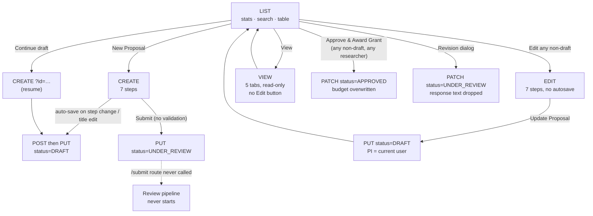
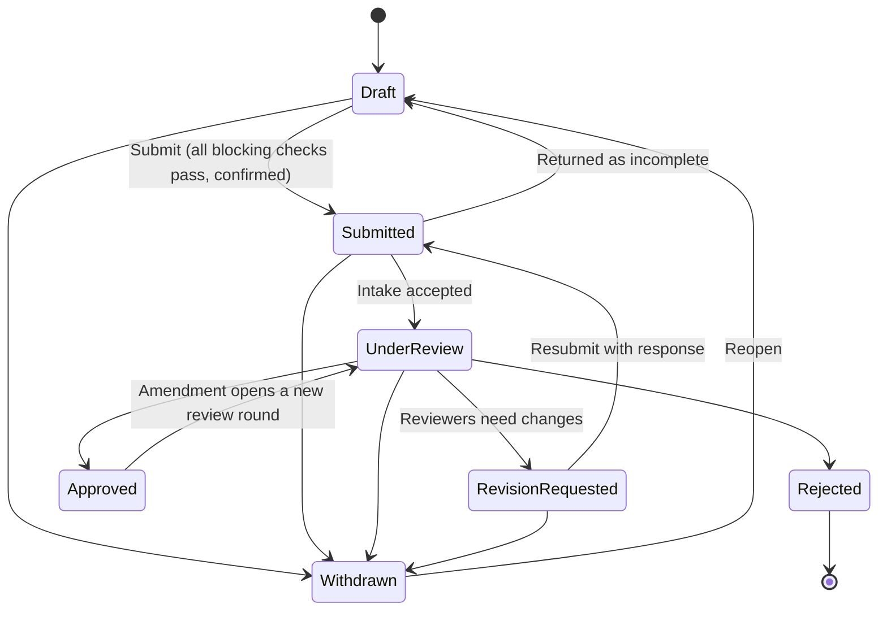

# HospitiumRIS — Researcher Proposals Module: Production-Readiness Analysis

**Pages analysed:** `/researcher/projects/proposals/list` · `/create` · `/view/[id]` · `/edit/[id]`
**Prepared for:** Stephen Gaita, HospitiumRIS
**Date:** 19 September 2026
**Companion document:** `proposals-implementation-plan.md` (phased plan, work items, acceptance criteria)
**Builds on:** *Review Process Analysis & Target-State Design* (19 Sep), *Security & Data-Privacy Gap Analysis* (18 Sep). Where a finding is already covered there, this report cross-references it (e.g. "RP PR-1") instead of repeating the analysis; new findings are marked **NEW**.

---

## 0. How this analysis was done (and its limits)

| Item | Detail |
|---|---|
| **Live inspection** | The four pages were opened on the running dev server (`localhost:3000`, Next.js 16.0.10, in the built-in browser pane, ≈800 px wide). Read-only API calls were made from the page (`GET` only). An automated accessibility scan (axe-core 4.10, WCAG 2.0/2.1 A + AA rules) was run on each page. Light/dark theme was toggled on the list page (and set back to light). axe-core was injected into each page for the scan only; nothing was persisted. |
| **Code review** | For all four pages: state, data loading, validation, save/submit and navigation logic read in full, and the JSX searched for fields, labels, actions and accessibility attributes (the 4,730-line create page's step bodies were sampled, not read line by line); the proposal API routes (`api/proposals/**`); the shared `PageHeader`, `ProposalReviewStatus`, `AuthProvider`, `auth-server`, `lib/prisma`; the `Proposal` Prisma model; CI workflow; i18n setup. |
| **Not executed** | **No data was created, changed or deleted.** Write paths (submit, edit-save, approve, delete, file upload) were verified by reading the code, not by running them, so your dev data stays intact. Each finding is tagged **L** (observed live), **C** (verified in code) or **L+C**. Findings tagged **C** should be reproduced against a scratch database as the first task of Phase 0 (see the plan). |
| **Environment caveats** | The browser pane was ≈800 px wide, so wide-desktop layout was not assessed visually. The pane had no server session (`/api/auth/me` → 401), which is itself informative: all four pages and their data still loaded (finding X-1). Automated a11y scanning finds roughly a third of WCAG issues; a manual keyboard/screen-reader pass is still needed for steps 2–7 of the wizard. |
| **Benchmark** | "Industry standard" is taken from research-administration (pre-award) systems. Vendor material was consulted for one reference point (Kuali Research's published capability list and approval-routing help page — see Appendix C). Everything else in Section 6 is general domain practice, not a vendor comparison. |
| **Not in scope** | Grant tracker, liaison threads, institution-side review pages, ethics and clinical-trial modules (covered in the Review Process report). |

---

## 1. Executive summary

### 1.1 Verdict

The Proposals module **is not production-ready**. The four pages look consistent and the happy path *appears* to work, but underneath there are **data-integrity defects that silently corrupt records** (editing an approved proposal turns it back into a draft and re-assigns the principal investigator), **a researcher can approve and award their own proposal**, **there is no authentication on the pages or the proposal API**, and **"Submit" accepts a proposal with nothing but a title and bypasses the configured review workflow**. Several routes (progress tracking, file download, ethics linking) are also broken outright by the Next.js 16 upgrade.

None of this needs a rewrite. The structure — a seven-step wizard, ORCID lookups, auto-save intent, list/view/edit split, an existing review-pipeline data model — is sound. The work is (1) a **server-side domain layer** that owns validation, status, authorisation and files, (2) **one shared form** replacing the two 2,400–4,700-line copies, and (3) a **design-system pass** (tokens, dark mode, accessibility, i18n) applied through a few shared components.

### 1.2 Scorecard

| Dimension | Rating | Why (one line) |
|---|---|---|
| Data integrity | **Blocker** | Edit reverts status and PI; approve overwrites requested budget; resume-draft wipes dates; edits to publication links are discarded. |
| Security & access control | **Blocker** | No auth on pages or on `GET/PUT/PATCH/DELETE`; client can set status; files: unsanitised names, absolute server paths in API output. |
| Workflow correctness | **Blocker** | Submit bypasses the review pipeline; no completeness check; revision loop broken; feedback never reaches the researcher. |
| Functionality completeness | **Major gaps** | Dead controls (sort, timeframe, "Delete Proposal"), no Edit on view page, view omits team/milestones/publications, no budget breakdown, no versioning. |
| UX & visual design | **Needs work** | Clean look on light theme, but redundant headers, uniform status colours, `alert()`/`confirm()` everywhere, leftover placeholder copy, dark mode unreadable. |
| Accessibility | **Major gaps** | axe: critical unnamed buttons on every page, contrast failures (2.5–3.3:1) on list/view, no headings or tab panels on view. |
| Performance & scalability | **Needs work** | N+1 tracking calls (all failing), full-record list payload, fixed 50-row client pagination, per-keystroke fetch, `new PrismaClient()` + `$disconnect()` per request. |
| Maintainability & testing | **Major gaps** | ≈10,000 lines across four near-duplicate pages, 183 hard-coded copies of the brand colour in one file, zero tests, no lint config. |
| Internationalisation | **Major gaps** | 19 locales exist in the platform; these pages use `t()` in 2 places (view: 0). |

### 1.3 Ten findings that matter most

| # | Finding | IDs |
|---|---|---|
| 1 | **Editing any proposal resets it to DRAFT and re-assigns the PI** to whoever is editing (and clears the ORCID, which removes it from the owner's list). | E-1, E-2 |
| 2 | **Researchers can "Approve & Award Grant" on their own proposals** from the list menu; the API also overwrites the *requested* budget with the awarded amount. | L-1, A-3 |
| 3 | **No authentication or authorisation** on the pages or on the proposal API. Anonymous requests returned every proposal and full proposal detail. | X-1, A-1 |
| 4 | **Submit accepts a title-only proposal** (the step validator exists but is never called) and **does not start the review workflow**. | C-1, C-2 |
| 5 | **Seven proposal route handlers are broken under Next.js 16** (`params` is now a Promise): tracking, file download, ethics linking, submit, review-stage. Confirmed live on two. | X-3 |
| 6 | **Silent data loss paths:** resuming a draft wipes its dates; publication/manuscript edits are discarded; uploading one file drops the previous file records; auto-save re-uploads files (37 MB / 37 items on disk, many duplicates). | C-5, E-3, E-4, C-7 |
| 7 | **The feedback loop is dead:** rejection/revision reasons never display; Review History is always empty (even for an approved proposal). | L-5, V-2 |
| 8 | **Placeholder and developer data shown to users:** a developer's name and ORCID as "my profile"; the literal text `Add "Microbiology"` under the PI; a hard-coded fallback department. | C-3, V-1 |
| 9 | **Dead controls:** Sort By and Timeframe filters do nothing; "Delete Proposal" only closes the menu; the status filter lacks Rejected / Revision / Submitted; the view page has no Edit button. | L-2, L-6, L-8, V-3 |
| 10 | **Dark mode is unreadable**, brand colour fails contrast, and the pages ignore the theme and i18n systems that already exist. | X-9, X-10, X-8 |

### 1.4 Finding counts

| Severity | Count |
|---|---|
| Critical | 7 |
| High | 27 |
| Medium | 23 |
| Low | 5 |
| **Total** | **62** (55 are new; 7 restate findings from the Review Process / Security reports and are cross-referenced: X-2, X-4, C-2, C-8, C-12, A-1, A-6) |

### 1.5 What is already good and should be kept

- The **seven-step wizard structure** and its content grouping map well onto how researchers think about a proposal.
- **ORCID search** for PI and co-investigators (`OrcidSearchModal`) — a real differentiator.
- **Intent** of auto-save, unsaved-changes guard and `beforeunload` on the create page (the implementation needs fixing, the idea is right).
- The **newer milestones/deliverables routes** (`api/proposals/[id]/milestones`) already show the target pattern: shared Prisma singleton, session check, input validation, sanitised filenames. They are the in-repo template for the rest.
- `lib/prisma.js` (singleton + connection guard), the **theme provider with light/dark**, **19-locale i18n**, `PageHeader`, and the existing **review pipeline / auto-review data model**.
- Sensible empty and loading states on the list page.

---

## 2. Understanding the module

### 2.1 Purpose and users

The module lets a **researcher** draft a research-project proposal, submit it for institutional review, track its status, and (after approval) hand it on to the grant tracker. A **research administrator** reviews it on the institution side (out of scope here). The four pages are the researcher's whole experience of a proposal.

### 2.2 Page and code inventory

| Page | File | Lines | Role |
|---|---|---|---|
| List | `researcher/projects/proposals/list/page.js` | 1,444 | Stats, search/filter, table, row actions, approve/award dialog, revision-response dialog |
| Create | `…/create/page.js` | 4,730 | 7-step wizard, auto-save, unsaved-changes guard, submit + notifications |
| View | `…/view/[id]/page.js` | 1,417 | Read-only detail in 5 tabs; `page_backup.js` left beside it |
| Edit | `…/edit/[id]/page.js` | 2,471 | Copy of the wizard for existing proposals |
| Shared | `components/Proposals/ProposalReviewStatus.js` (220), `components/common/PageHeader.js`, `create/components/OrcidSearchModal.jsx` (367) | | |
| API | `api/proposals/route.js` (281), `[id]/route.js` (446), `[id]/{submit,status,review,review-stage,review-status,files/[fileName],link-ethics,milestones,deliverables}` | ≈1,800 | |

### 2.3 Data model (as built)

`Proposal` is a single wide table: core fields, long-text sections, `Json[]` for co-investigators, milestones, deliverables and **file metadata**, a single `totalBudgetAmount`, ethics fields as free strings, grant-tracking fields, and a `ProposalStatus` enum (`DRAFT, SUBMITTED, UNDER_REVIEW, APPROVED, REJECTED, REVISION_REQUESTED`). It has **no owner (`userId`) and no institution** — the schema still carries the comment `TODO: Add userId when authentication is implemented`. Researcher scoping therefore relies on matching the PI's ORCID string.

### 2.4 API surface (as built)

| Endpoint | Auth check | Notes |
|---|---|---|
| `GET /api/proposals` | Partial (optional user; filters only if researcher **has an ORCID**) | Returns full rows; `limit` uncapped; `total` = page length |
| `POST /api/proposals` | **None** (dev stub `dev-user-id`, unused) | Multipart; saves files; accepts `status` from client; omits `impactStatement`/`disseminationPlan` |
| `GET /api/proposals/[id]` | **None** | Returns everything incl. file metadata with absolute server paths |
| `PUT /api/proposals/[id]` | **None** | Full replace; `status: … \|\| 'DRAFT'`; ignores publication/manuscript links; replaces file arrays |
| `PATCH /api/proposals/[id]` | **None** | Sets any status; overwrites budget; fabricates an approval review |
| `DELETE /api/proposals/[id]` | **None** | Any status, no ownership, hard delete, files left on disk |
| `POST …/submit`, `GET …/review-status`, `GET …/files/[fileName]`, `…/link-ethics*`, `POST …/review-stage` | None | **All read `params` synchronously → broken on Next.js 16** |
| `PATCH …/status` | Session required | No ownership check; stores a status log inside `otherRelatedFiles` (the file list) |

---

## 3. The workflow as built



### 3.1 What the UI offers in each status — and what it should

| Status | List offers today | Should offer |
|---|---|---|
| Draft | View, Continue, Discard | View, Continue, Delete (soft), Submit (after checks) |
| Submitted / Under review | View, **Edit**, **Approve & Award**, "Delete" (no-op) | View, Withdraw. **No edit, no approve.** |
| Revision requested | View, Edit, Approve & Award, revision dialog | View, **Revise** (opens edit in "revision mode" showing reviewer comments), Resubmit, Withdraw |
| Approved | View, **Edit**, Approve & Award again | View, Request amendment, Open in grant tracker |
| Rejected | View, Edit, Approve & Award | View, Clone as new draft |

**Observed live (list page):** 3 proposals — 2 Approved, 1 Under review. All 3 show "No pipeline assigned" in the *Review Pipeline* column, including the one under review, because tracking is never created *and* the tracking route returns 500 for every proposal (finding X-3).

### 3.2 Where the workflow breaks, in order of the researcher's journey

1. **Create** — a researcher can click Submit at step 1 with only a title; there is no review-and-submit step, no confirmation, no summary of what is missing.
2. **Submit** — writes `UNDER_REVIEW` through the ordinary save endpoint; the route that would start the configured pipeline is never called (and is broken on Next.js 16 anyway).
3. **Wait** — the researcher sees a purple "UNDER REVIEW" chip and "No pipeline assigned". No stage, owner, expected date or notification (the notification payloads are rejected by the server — RP NT-1).
4. **Feedback** — if revisions are requested, the dialog looks for fields the API never returns → "No specific feedback provided". The response is discarded and the status flips back.
5. **Edit** — allowed in every status; saving sets DRAFT and reassigns the PI.
6. **Approved** — the view page still shows "Days in Review", "No review history… first review", and *Budget: Not specified*.

---

## 4. Findings register

**Severity** reflects impact on data integrity, security, and the researcher's ability to complete the workflow — not effort to fix. **Check:** L = observed live, C = verified in code, L+C = both. Paths are relative to `src/app/` unless shown otherwise. `RP` = the Review Process report; `SEC` = the Security report.

### 4.1 Cross-cutting

| ID | Sev | Finding | Evidence | Check |
|---|---|---|---|---|
| X-1 | High | **No route guard for `/researcher/**`.** There is no `layout.js`, `middleware` or `proxy` for the researcher area; the pages render for unauthenticated visitors. In this session `/api/auth/me` returned 401 yet the list, view, edit and create pages all rendered and loaded data. | `researcher/` has no `layout.js`; no `src/middleware.js` / `proxy.js`; live: `auth/me` → 401 while `/list` showed 3 proposals | L+C |
| X-2 | Critical | **Status is client-controlled** (RP XC-2 / PR-2). The create page sends `UNDER_REVIEW`, the edit page sends `DRAFT`, the list page PATCHes `APPROVED`; the API accepts all of it. Restated here because the UI paths are now specific (L-1, E-1, C-2). | `api/proposals/route.js:233`; `[id]/route.js:268,346`; `edit/[id]/page.js:417`; `list/page.js:285` | C |
| X-3 | High | **Next.js 16 breaks synchronous `params`.** In Next 16 route `params` is a Promise. Seven handlers in six proposal route files still do `const { id } = params;` so `id` is `undefined` and Prisma throws. Confirmed live: `GET …/review-status` → **500**, `GET …/files/{name}` → **500**. Consequences: the tracking stepper never renders, file download never works, ethics linking, `submit` and `review-stage` cannot run. 24 handlers repo-wide use the same pattern. | `api/proposals/[id]/{files/[fileName],link-ethics,link-ethics/[ethicsId],review-stage,review-status,submit}/route.js` (line 8–9, 82); working pattern: `[id]/route.js` (`await params`) | L+C |
| X-4 | High | **`Proposal` has no owner or institution** (RP PR-5). Ownership is inferred from the PI's ORCID string, so anything that changes the PI (E-2) also changes who can see the proposal, and a researcher without an ORCID iD is not filtered at all (A-6). | `prisma/schema.prisma` `model Proposal` (`TODO: Add userId…`); `api/proposals/route.js:39–41` | C |
| X-5 | High | **A new `PrismaClient` per route file, disconnected after every request.** 78 API files call `new PrismaClient()`; the proposal routes call `$disconnect()` in `finally`. A singleton (`lib/prisma.js`) already exists and its own comment warns that a handler calling `$disconnect()` causes "Engine is not yet connected" errors. Risk: connection exhaustion under load and intermittent 500s. | `api/proposals/route.js:8,279`; `[id]/route.js:7,131,323,391,445`; `lib/prisma.js` | C |
| X-6 | High | **No server-side validation layer.** Title, dates (end > start), budget (`parseFloat` can yield `NaN`), array sizes and enum values are not checked; `JSON.parse` of the form payload is unguarded (malformed body → 500). The only validation is in the browser and is largely not enforced (C-1). | `api/proposals/route.js:118–235`; `[id]/route.js:172–270` | C |
| X-7 | Medium | **No automated tests and no lint configuration.** No `*.test.*`/`*.spec.*` files, no test runner, `devDependencies` are only `@types/node` and `typescript`; the CI workflow runs `npm run lint` and `npm run build` but the repo has no ESLint config or dependency — confirm the lint job is actually linting. | repo search; `package.json`; `.github/workflows/ci.yml` | C |
| X-8 | Medium | **Internationalisation is not applied.** The platform ships 19 locale files, but `t()` appears twice in list, twice in create, twice in edit and **not at all in view**. Dates (`en-US`) and currency (`USD`) are hard-coded. | `lib/i18n.js`; `public/locales/*`; grep of the four pages | L+C |
| X-9 | High | **Dark mode is broken on these pages.** The theme provider supports dark mode, but pages hard-code colours (110 / 320 / 157 / 172 hex literals in list / create / view / edit; the brand purple `#8b6cbc` appears 183 times in create alone). Observed live in dark mode: filter bar labels and values invisible, table rows dark with dark text, headers light — unreadable. | screenshots (list, dark); `components/ThemeProvider.js` vs page `sx` props | L+C |
| X-10 | Medium | **Accessibility defects on every page** (automated scan). See 4.7 for the table. Highlights: an icon button with no accessible name on every page (critical), three unlabelled selects on the list, contrast failures of 2.5–3.3:1 (stat cards, view-page captions), no headings on the view page, tabs without tab panels. | axe-core 4.10 results | L |
| X-11 | Medium | **Inconsistent status language and colour.** List: every status chip is the same purple; view: APPROVED is blue; `getStatusColor` in the list is defined but unused; the view page handles a `REQUIRES_AMENDMENT` status that does not exist in the enum and does not handle `REVISION_REQUESTED`. Five status vocabularies exist across the platform (RP XC-3). | `list/page.js:849`; `view/[id]/page.js:217–238`; `schema.prisma` `ProposalStatus` | L+C |
| X-12 | Medium | **Copy-paste divergence.** Create (4,730 lines) and Edit (2,471) duplicate constants and all seven step bodies; POST and PUT duplicate ~150 lines of upload/mapping code. Drift is already visible: only create has auto-save, the unsaved-changes guard and ethics linking; POST omits two fields that PUT saves (A-5). | file sizes; `api/proposals/route.js` vs `[id]/route.js` | C |
| X-13 | Low | **Repo hygiene.** `view/[id]/page_backup.js`, `researcher/page.js.backup`, `docs/*copy.md`; a `simulateStatusUpdate` demo function in the view page; `console.log` debug output in the create validator and API routes. | `view/[id]/page.js:184`; `create/page.js:4266`; `api/proposals/route.js:32,33,57,66` | C |

### 4.2 List page

| ID | Sev | Finding | Evidence | Check |
|---|---|---|---|---|
| L-1 | Critical | **A researcher can "Approve & Award Grant" on their own proposal.** The row menu offers it for every non-draft proposal; it PATCHes `status: APPROVED` and an award amount (pre-filled with a hard-coded `450000` when the proposal has no budget), and the API writes an approval review under the name "Research Administrator". This is a role-boundary violation, not just a UI bug: approval belongs to the institution side (RP PR-2). | `list/page.js:261,276–300,1069`; `api/proposals/[id]/route.js:338–366` | C |
| L-2 | High | **Sort By and Timeframe filters are cosmetic.** Their state is declared and bound to the dropdowns but never used to filter or sort the data. "Recent / Title / Status / Due Date" and "This Year / Last 6 Months / Last 3 Months" all return the same rows. | `list/page.js:81–82,620–669`; filter logic `:184–194` uses only search + status | L+C |
| L-3 | High | **List data handling does not scale and misreports.** The page requests a fixed `limit=50` and paginates client-side; the four stat cards are computed from the loaded rows only; the API's `total` is the page length, not a count; the response is the full row (every long-text field, arrays and file metadata) — ≈5–7 KB per proposal (48 fields) for a list that needs ~10; `limit` is uncapped (`limit=100000` accepted). With >50 proposals the cards and pagination are wrong. | `list/page.js:120,155–160`; `api/proposals/route.js:29,87` | L+C |
| L-4 | High | **N+1 tracking requests, all failing.** After the list loads the page fires one `review-status` request per proposal. Live: every one returns 500 (X-3), the error is swallowed, and the column falls back to "No pipeline assigned". | `list/page.js:134–152`; live `GET …/review-status` → 500 | L+C |
| L-5 | High | **Rejection / revision feedback never reaches the researcher.** The status dialog reads `reviewFeedback`, `rejectionReason`, `amendmentRequirements`, `missingFiles`, `reviewerComments`, `reviewedBy`, `reviewedAt` — none of which the API returns — so it always says "No specific feedback provided". The researcher's response text is sent in a PATCH that ignores it and flips the status back to `UNDER_REVIEW` (RP PR-7). | `list/page.js:1202–1400` (reads at 1282); API response keys (live); `[id]/route.js:338` | L+C |
| L-6 | Medium | **Dead and blocking controls.** "Delete Proposal" in the row menu only closes the menu; discard uses `window.confirm`; eight flows use `alert()`; there is no undo and no toast. | `list/page.js:240–354,1072–1074` | C |
| L-7 | Medium | **Search refetches on every keystroke** (effect depends on `searchQuery`), fetches twice on mount (two effects), then filters again client-side (server and client filters disagree: server search on research areas is exact-match). **A failed fetch is shown as "No proposals found"** — the error is hidden. | `list/page.js:174–182,184–194,163–168` | C |
| L-8 | Medium | **Filters and stats ignore half the lifecycle.** The Status dropdown lists only Draft / Under Review / Approved; Submitted, Revision Requested and Rejected proposals cannot be filtered. The cards cover Total / Approved / Under review / Draft only, so they do not add up once other statuses exist. | `list/page.js:620–623`; cards | L+C |
| L-9 | Medium | **"Review Pipeline" column shows no useful information.** For all non-draft proposals it reads "No pipeline assigned" (observed). Researchers need *current stage, who has it, days in stage, what's needed from me* — not a pipeline name. | live; `list/page.js:877–881` | L |
| L-10 | Medium | **Table usability.** Rows are not clickable and the title is not a link; actions are icon-only with tooltips (one icon button has no accessible name); at ≈800 px the title column collapses to a word per line and the table scrolls horizontally; the Date Range column shows project dates, not last-updated or submission date. | live screenshots; `list/page.js:795–1000` | L |
| L-11 | Low | **Weak visual hierarchy.** All four stat cards are the same purple and are not clickable filters; status chips are uniform; white text on `#8b6cbc` is 4.2:1 and the tinted captions 2.9–3.3:1 (below AA). | axe; `list/page.js:849` | L |
| L-12 | Medium | **Missing list capabilities** expected in a proposal register: reference number, funder/sponsor, requested budget, last updated, "needs my action", saved views, CSV export, bulk actions, column chooser. | list columns | C |

### 4.3 Create page

| ID | Sev | Finding | Evidence | Check |
|---|---|---|---|---|
| C-1 | Critical | **Submit performs no validation and asks for no confirmation.** `Submit Proposal` calls the save routine with `UNDER_REVIEW`, which only requires a non-empty title. A step validator (`isStepValid`) exists — required fields per step — but is **never called**; "Next Step" is hard-coded `disabled={false}`. A title-only proposal can be submitted for review. | `create/page.js:571–580,827,4256–4290,4585` | C |
| C-2 | Critical | **Submit bypasses the configured review workflow** (RP PR-1). It sets the status through the generic save; the pipeline-start endpoint is never called (and cannot run on Next 16 — X-3). | `create/page.js:827` | C |
| C-3 | High | **A developer's identity is hard-coded as "your profile".** Every user sees "Steve Gaita (0009-0009-4810-6393)" under "Use my profile as Principal Investigator", and the disabled name/ORCID fields are filled with the same literals. The value actually saved comes from the signed-in user, so the screen misstates what will be stored. | `create/page.js:1326,1374,1413`; saved value `:590–595` | L+C |
| C-4 | High | **"Search for a different Principal Investigator" cannot be saved.** The ORCID picker sets `formData.principalInvestigator`, but the save routine reads `formData.principalInvestigatorName`, which is never set → the PI name is `undefined`. For a new proposal the create request fails on the required `principalInvestigator` column; for a resumed draft the update silently keeps the old PI. | `create/page.js:592,1164` (handler); initial state `:357–418` | C |
| C-5 | High | **Resuming a draft loses data.** `loadExistingProposal` does not restore `startDate`/`endDate` (the next auto-save writes `null` over them); grant dates are restored as ISO timestamps that `<input type="date">` cannot display; the PI option is reset to "use my profile" (overwriting the stored PI on next save, see E-2); attached files are not restored (arrays reset to `[]`). | `create/page.js:254–352` | C |
| C-6 | Medium | **A blank form says "Unsaved changes"** and arms the browser's "leave site?" prompt, because defaults (`piOption`, status strings) count as user data. After loading a draft the snapshot used for comparison is the *initial* state, so the same happens on every resumed draft. | live ("Unsaved changes" chip on `/create` with nothing entered); `create/page.js:419–431,346` | L+C |
| C-7 | High | **Auto-save is unreliable and duplicates files.** It fires only on step change, title edit, or when the dirty flag first flips — not while typing in other fields — and "Next" starts it without waiting. Until the first POST returns, `proposalId` is null, so two quick saves can create two drafts. Each save re-uploads *every* attached file with a new timestamped name: `uploads/proposals` holds 37 items / 37 MB including 6 copies of one ethics PDF and 5 of one data-management plan. | `create/page.js:434–443,1198–1204,632–678`; live disk listing | L+C |
| C-8 | High | **Submission notifications are rejected by the server** (RP NT-1): payloads use `recipientId` / `recipientRole` / `recipientEmail`, the service needs a `userId`; errors are swallowed. The researcher, the research office and co-investigators are never told. | `create/page.js:834–890` | C |
| C-9 | Medium | **Form content falls short of a proposal record.** No sponsor/call reference, keywords, or proposal type; the budget is one number with a hard-coded `$` (no lines, categories, years, currency, justification, cost-share); milestones and deliverables have no owner, dependency or effort; team members have no role/effort/COI; attachments are three untyped buckets (no CV, letters of support, budget justification); no character limits on long text except an abstract counter on the edit page only. | `create/page.js:2150–2570,2573–2870,3505–3845` | C |
| C-10 | Medium | **Wizard UX gaps.** No "Review & Submit" step — step 7 is a collaborative-proposal linker, not a summary; "Progress" is the step index (14 % on step 1), not completion; no per-step error/complete state; step labels overflow at ≈800 px (observed); the ethics step mixes manual entry and linking to an existing application with no clear precedence. | live; `create/page.js:3846–3990,4495–4535` | L+C |
| C-11 | Medium | **Weak client-side upload rules.** `accept=` lists extensions only; no size or count limit; the third bucket accepts `.jpg,.png,.pptx`; no progress or per-file error. | `create/page.js:3300,3434,3775` | C |
| C-12 | Medium | **Ethics linking uses a global, unauthenticated list** filtered by a client-supplied `userId` (`/api/ethics/applications?userId=…`) (SEC C5). | `create/page.js:471` | C |
| C-13 | Low | **Maintainability:** one 4,730-line component with 446 `sx` blocks, `console.log` in the validator, and dead code (`isStepValid`, `hasBeenReviewed`-style helpers). | file | C |

### 4.4 View page

| ID | Sev | Finding | Evidence | Check |
|---|---|---|---|---|
| V-1 | High | **Placeholder text is shown to users.** Under the title and in *Principal Investigator & Team* the page prints `Add "Microbiology"` — the label of the Autocomplete's "add new" option pasted into a display line — and falls back to a fabricated department, "Clinical Research & Epidemiology", when none exists. | live; `view/[id]/page.js:368,695` | L+C |
| V-2 | High | **Review History is always empty.** The tab and dialog read `proposal.reviewHistory`, which the API does not return (it does not include the `reviews` relation), so an **APPROVED** proposal says "No review history available… This will be the first review." A demo function `simulateStatusUpdate` is left in the file. | live; `view/[id]/page.js:184,260,1226,1330`; `[id]/route.js:16–43` | L+C |
| V-3 | High | **Wrong context and no actions.** Breadcrumb reads "Institution / Proposal Review / Details" on the researcher route; the only action is "Back to List" — `handleEdit` exists but is never wired to a button. No Edit, Submit, Withdraw, Duplicate, Export/Print, or "Open in grant tracker". | live; `view/[id]/page.js:167,329–341` | L+C |
| V-4 | Medium | **Derived numbers are wrong or meaningless.** Duration is `ceil(days / 30)`: 1 Sep 2026 → 31 Aug 2029 is exactly 36 months but shows **37**. "Days in Review: 110 days" is `now − createdAt`, shown for an *approved* proposal. "Submitted: June 2, 2026" is the creation date; there is no submitted date. Budget shows "Not specified" for an approved proposal. | live; `view/[id]/page.js:484,627,662` | L+C |
| V-5 | High | **The page omits most of what was captured.** Co-investigators, milestones, deliverables, linked publications and manuscripts, grant number/dates and any budget breakdown are not displayed anywhere (no reference to them in the page; the API already returns publications and manuscripts). A researcher cannot review their own submission in full. | grep of `view/[id]/page.js`; tab text (live) | L+C |
| V-6 | Medium | **Documents tab is fragile.** It builds its list from three raw arrays (not the `documents` array the API prepares), shows "Uploaded: today" when a date is missing, labels the button "View" though it forces a download, and calls the file route that fails on Next 16 (X-3). Status-log entries stored in `otherRelatedFiles` (A-7) would render as files. | `view/[id]/page.js:203–214,977–1196`; `[id]/route.js:59–116` | C |
| V-7 | Medium | **Semantics.** Numbered objectives and methodology collapse into one paragraph (line breaks and lists lost); the page has **no heading elements** (h1–h6 count = 0 — titles are styled `Typography`); tabs have no `tabpanel` role, no `aria-controls`, and the active tab is not in the URL (refresh returns to Overview). | live (DOM query) | L |
| V-8 | Medium | **Contrast.** Captions (`#9ca3af` on white) measure 2.5:1 across 12 elements; the icon-only top-bar button lacks a name. | axe | L |

### 4.5 Edit page

| ID | Sev | Finding | Evidence | Check |
|---|---|---|---|---|
| E-1 | Critical | **Every save resets the proposal to DRAFT.** The edit payload hard-codes `status: 'DRAFT'`, and the PUT applies `status || 'DRAFT'`. The list offers Edit on every non-draft proposal, so editing an **Approved** or **Under review** proposal silently sends it back to Draft (and out of the review queue). | `edit/[id]/page.js:417`; `api/proposals/[id]/route.js:268` | C |
| E-2 | Critical | **The editor becomes the PI.** After loading, `piOption` is forced to "use my profile"; on save the PI name and ORCID come from the *current user* (`'Current User'` and `null` if the session is not loaded yet). A co-investigator or administrator who edits changes the PI; a null ORCID removes the proposal from the original owner's ORCID-filtered list (X-4). | `edit/[id]/page.js:284,369–373` | C |
| E-3 | High | **Edits to linked publications and manuscripts are discarded.** The edit form starts those lists empty ("will be loaded separately" — they never are), sends them on save, and the PUT handler has no code for publication/manuscript relations (only POST creates them). Users see "updated successfully". | `edit/[id]/page.js:253,258,317,321,408–410`; `[id]/route.js:135–325` | C |
| E-4 | High | **File edits do not work.** Existing files are listed with a remove button that only changes local state (the server has no delete path); when *any* new file is uploaded in a category, the PUT **replaces** that category's array, dropping the records of earlier files while the files stay orphaned on disk; existing (non-`File`) entries are never re-sent. | `edit/[id]/page.js:423–436`; `[id]/route.js:272–281` | C |
| E-5 | High | **No concurrency control or history.** PUT is a last-write-wins full replace; `updatedAt` is not used as a version; two collaborators overwrite each other silently; no revision snapshot or change log exists to recover from E-1/E-2-type damage. | `[id]/route.js:240–320` | C |
| E-6 | High | **No rules or context for editing by status.** No banner ("this proposal is under review"), no lock, no "revision mode" showing reviewer comments, no "reason for change", no re-submit action. Editing is treated as the same activity in every status. | `edit/[id]/page.js` (whole); `list/page.js:966–969` | C |
| E-7 | Medium | **Validation and safety nets are missing** compared with create: no unsaved-changes prompt or auto-save; departments and date-order errors are shown but do not block saving; "Update Proposal" appears twice on the last step; "Next Step" is always enabled. | `edit/[id]/page.js:758–799,2360–2402` | C |
| E-8 | Low | **Redundant headings.** The breadcrumb ("Edit Proposal / Edit Project Proposal"), the page-header title, and a 34-px card heading ("Edit Proposal: <full title>") all repeat the same information and push the form below the fold on small screens. | live | L |

### 4.6 API and files

| ID | Sev | Finding | Evidence | Check |
|---|---|---|---|---|
| A-1 | Critical | **`GET /[id]`, `PUT`, `PATCH`, `DELETE` and `POST` perform no authentication or authorisation** (POST carries an unused `dev-user-id` stub). Anonymous requests (credentials omitted) returned the full list and a full proposal including PI ORCID, co-investigators and funding details. Writes are unchecked by code reading; they were not exercised. (RP XC-1, SEC C-series.) | `api/proposals/route.js:106`; `[id]/route.js`; live anonymous `GET`s | L+C |
| A-2 | High | **`DELETE` is a hard delete for any status, by anyone.** It removes join rows and the proposal (including Approved ones), no ownership or status check, no soft delete or audit entry, and leaves uploaded files on disk. | `[id]/route.js:395–445` | C |
| A-3 | High | **Approve overwrites the requested budget.** `PATCH` writes `awardedAmount` into `totalBudgetAmount`, destroying what the researcher asked for (a separate `grantRequestedAmount` column exists) and inserts a review row with a hard-coded reviewer name and empty scores. | `[id]/route.js:346–366` | C |
| A-4 | High | **File handling is unsafe and non-portable.** File names go into the path unsanitised (`` `ethics_${Date.now()}_${file.name}` ``) — whether a crafted multipart filename containing `../` survives parsing should be tested (the milestone route already sanitises names); the **absolute server path** (`filePath`) is stored and returned to clients; no size, count, type or content check; no virus scan; files live on the app container's disk (RP/migration doc flags this for the Python move). | `api/proposals/route.js:135–180`; `[id]/route.js:189–235`; `milestones/route.js:15–20` (safe pattern) | C |
| A-5 | Medium | **POST and PUT disagree.** POST does not save `impactStatement` or `disseminationPlan`; PUT does. The first save of a new proposal therefore drops the Proposal Summary fields. | `api/proposals/route.js:186–235`; `[id]/route.js:284–285` | C |
| A-6 | High | **Researcher scoping fails open** (RP PR-5). The visibility filter applies only when the caller is a researcher *with an ORCID*; otherwise the query has no filter and returns every institution's proposals. | `api/proposals/route.js:38–46` | C |
| A-7 | Medium | **Audit data is stored in the file list.** `PATCH …/status` appends a status-log object to `otherRelatedFiles`, so file metadata and history share one array; `PATCH` maps project states onto review statuses (Active/Completed → `APPROVED`) with no ownership check. | `api/proposals/[id]/status/route.js:5–11,47–55` | C |
| A-8 | Low | **Noisy and leaky logging.** `console.log` of query params, user ORCID/institution and where-clauses; activity log records `userId: null` for these calls; all failures return a generic 500 without an error code. | `api/proposals/route.js:32–66`; `logs/activity.log` | L+C |

### 4.7 Accessibility scan results (axe-core, WCAG 2.0/2.1 A + AA)

| Page | Rule | Impact | Elements | Detail |
|---|---|---|---|---|
| List | `color-contrast` | Serious | 27 | Stat-card labels 3.33:1, captions 2.93:1 (on `#8b6cbc`) |
| List | `aria-input-field-name` | Serious | 3 | Status / Timeframe / Sort selects unlabelled for AT |
| List | `button-name` | Critical | 1 | Icon-only button without name |
| View | `color-contrast` | Serious | 12 | Captions `#9ca3af` on white = 2.54:1 |
| View | `button-name` | Critical | 1 | Same icon-only button |
| Edit | `button-name` | Critical | 3 | Icon-only buttons (remove/search) |
| Edit | `color-contrast` | Serious | 1 | Outlined button `#8b6cbc` on white = 4.22:1 |
| Create | `button-name` | Critical | 1 | Icon-only button |

Brand purple `#8b6cbc` is 4.23:1 against white — acceptable only for large text. A darker primary such as `#6f52a3` (6.16:1) fixes buttons, links and chips without changing the look. Steps 2–7 of the wizard, dialogs and error states were **not** scanned; a manual keyboard and screen-reader pass is part of Phase 5 in the plan.

---

## 5. Benchmark: gaps against research-administration practice

Reference point: the published capability list and approval-routing help of a widely used pre-award system, **Kuali Research** ([capabilities](https://www.kuali.co/products/sponsored-programs), [approval process](https://kuali-research.zendesk.com/hc/en-us/articles/360007791114-Proposal-Proposal-Development-Approval-Process)), supplemented by general domain practice. This is a capability yardstick, not a feature-parity target: HospitiumRIS is a research-intelligence platform for hospitals and institutes, and the aim is a *credible, auditable proposal record and hand-off*, not to rebuild a grants ERP.

| Capability (typical in this class of system) | HospitiumRIS today | Gap | Priority |
|---|---|---|---|
| Proposal record with **unique reference number** | None (cuid shown nowhere) | Add institution-scoped `PRP-YYYY-NNNN` | Must |
| **Validation and compliance checks before submit**, with a summary the submitter and approvers can see | Title only (C-1) | Section-level rules, blocking vs warning, submit checklist | Must |
| **Configurable internal routing/approvals**; next approver notified; action list | Pipeline exists, never triggered (C-2) | Call the engine on submit; notifications; researcher tracker | Must |
| **Approvers see a summary/submit screen** (general info, key personnel, compliance, attachments, budget) and can comment | Legacy admin page only | Shared read-only summary component reused on researcher and reviewer sides | Must |
| **Return to investigator with comments**, then resubmission | Broken (L-5, PR-7) | Revision loop with visible comments and point-by-point response | Must |
| **Audit trail & change tracking** across the proposal lifecycle | None (E-5) | Append-only event log + version snapshots on submit | Must |
| **Budget development** (categories, years, rates) | Single number (C-9) | Budget builder with lines, currency, justification, totals check | Should |
| **Key personnel** with role, effort, conflict-of-interest disclosure | Name/email/role text (C-9) | Structured member table, effort %, COI attestation | Should |
| **Typed attachments** (budget justification, CV, letters of support, DMP) with size/type rules | Three untyped buckets (C-11) | Attachment kinds, per-kind requirements, safe storage | Should |
| **Notice-of-intent / pre-proposal** stage | None | Optional lightweight "intent" record (later) | Could |
| **Shared reference data** (sponsors, departments, research areas) | Hard-coded arrays in each page | Institution-managed lists | Should |
| **Dashboards** for status and stakeholder visibility | Four stat cards on partial data (L-3) | Server-computed counts by status; "needs my action" | Should |
| **Role-based access** and institution scoping | Absent (X-1, A-1, X-4) | Owner/institution ownership + policy layer | Must |
| **Export / print** of the proposal (PDF) | None | Print-friendly view + PDF export | Should |

---

## 6. Target state

### 6.1 Design principles

1. **The server owns the rules.** Validation, status transitions, authorisation and file handling live in one server-side domain module. Pages call it; they never decide status or ownership.
2. **One form, three modes.** Create, resume and edit are the same component with the same schema; only the *mode* (draft / revision / amendment) and the allowed actions differ.
3. **Never lose work, never guess.** Debounced auto-save on every change with visible state ("Saving… / Saved 14:32 / Couldn't save — retry"), optimistic concurrency, and no silent discards.
4. **The researcher always knows where things stand.** Status, current stage, what is needed from them, and why (reviewer comments) are visible on the list and the view page.
5. **Tokens, not hex codes.** Colour, spacing and status styling come from the theme so dark mode, contrast and rebranding are one change.
6. **Accessible and translatable by default** (WCAG 2.2 AA; strings through `t()`; locale-aware dates and currency).
7. **Portable.** Rules are expressed as schemas and a small REST contract so the domain layer can move to FastAPI (Pydantic) with the planned Python backend without redesign.

### 6.2 Lifecycle and status (researcher-facing)

Single writer for status: the review engine described in the Review Process report (§8.4). The researcher-side view of that lifecycle:



### 6.3 What the researcher can do, by status

| Status | View | Edit | Submit / Resubmit | Withdraw | Delete | Other |
|---|---|---|---|---|---|---|
| Draft | ✔ | ✔ (owner, team) | ✔ | — | ✔ (soft, owner) | Duplicate |
| Submitted / Under review | ✔ | ✖ (locked, banner explains) | — | ✔ (with reason) | ✖ | Comment thread |
| Revision requested | ✔ | ✔ **revision mode** (comments panel, changed-fields tracking) | ✔ Resubmit | ✔ | ✖ | Point-by-point response |
| Approved | ✔ | ✖ | — | — | ✖ | Request amendment · Open in grant tracker · Export |
| Rejected | ✔ | ✖ | — | — | ✖ | Duplicate as new draft |
| Withdrawn | ✔ | ✖ | — | — | ✔ (soft) | Reopen as draft |

**Approve, award and set-status actions do not exist on researcher pages.** Approval and award are institution-side actions with a recorded reviewer; the awarded amount is stored separately from the requested budget.

### 6.4 List page

```
Research Proposals                                              [ + New proposal ]
┌ All 24 ┐┌ Draft 3 ┐┌ In review 5 ┐┌ Needs my action 2 ┐┌ Approved 12 ┐┌ Closed 2 ┐   ← clickable filters, counts from server
[ Search title, PI, reference…      ]  [ Status ▾ ] [ Funder ▾ ] [ Year ▾ ]  [ Saved views ▾ ]  [ Export CSV ]
┌──────────────┬──────────────────────────┬────────────┬───────────────┬───────────┬──────────┬────────┐
│ Ref          │ Title (link)             │ Status     │ Stage / next  │ Funder    │ Budget   │ Updated│ ⋮
│ PRP-2026-014 │ Genomic Epidemiology of… │ ● Approved │ —             │ Wellcome  │ $450,000 │ 2d ago │
│ PRP-2026-015 │ AI-Driven Cardiovascular │ ◐ In review│ Budget review · 4 d left │ … │ …        │ 1h ago │
│ PRP-2026-011 │ Predictive Modelling…    │ ▲ Revision │ Action: respond by 30 Sep│ … │ …        │ 5d ago │
└──────────────┴──────────────────────────┴────────────┴───────────────┴───────────┴──────────┴────────┘
Rows per page 25 · 1–24 of 24 · server-side sort & pagination
```

- **Server-side** search (debounced 300 ms), sort, filter and pagination (`GET /api/proposals?page&pageSize&sort&status&q`), returning a slim projection and per-status counts. `pageSize` capped at 100.
- Row click opens the view page; title is a link; the kebab holds secondary actions that depend on status (§6.3). Destructive actions use a confirmation dialog and a toast with *Undo*.
- **Stage/next-step column** replaces "Review Pipeline": current stage, days in stage/SLA, and a "Needs my action" badge for revision requests and conditions.
- Status chips: one shared `ProposalStatusChip` (icon + text + semantic colour, ≥ 4.5:1), the same on list and view.
- Loading = skeleton rows; error = inline alert with *Retry* (never the empty state); empty = illustration + CTA. On phones the table becomes stacked cards.
- Removed: Approve & Award, no-op Delete, cosmetic Sort/Timeframe (replaced by real ones).

### 6.5 Create / resume / edit — one form

**Steps** (keep seven, tighten the content):

| # | Step | Content changes |
|---|---|---|
| 1 | Basics | Title, proposal type, funder + call reference, dates, PI (profile or ORCID search), team table (role, effort %, ORCID/email, COI flag), departments |
| 2 | Science | Research areas, keywords, abstract (counter), objectives, methodology — rich text with lists |
| 3 | Work plan | Milestones and deliverables with owner and dates; simple timeline preview |
| 4 | Budget | Currency, lines by category/year, justification, cost-share; total is computed and checked against any entered total |
| 5 | Ethics & data | Human-participants question drives requirements; link an existing ethics application (owned by the user) or record external approval; DMP |
| 6 | Attachments & links | Typed attachments with size/type rules; linked publications and manuscripts |
| 7 | **Review & submit** | Read-only summary of every section, **checklist of blocking errors and warnings with "Fix" links**, declarations, confirm dialog. Replaces the current "Proposal Summary". |

**Behaviour**

- **Auto-save**: 2 s after the last change, partial update (`PATCH /api/proposals/:id`), with `version` for optimistic concurrency; status pill ("Saved 14:32"); on conflict, show "Updated by X — reload / compare"; on failure, keep local edits and retry with back-off. Blank forms are not "dirty"; a proposal is created on the first meaningful input (title).
- **Draft = permissive, Submit = strict.** Draft needs a title. Submit runs the full ruleset (Appendix A) on the server and returns a list of errors/warnings the UI renders in step 7; the client uses the same schema for instant feedback.
- **Field-level UX**: inline errors on blur, `aria-describedby`, error summary at top on failed submit, focus moved to the first error; step headers show ✔ / ! state; stepper is a real navigation list (keyboard, `aria-current="step"`).
- **PI rules**: PI = record owner unless deliberately changed via ORCID search; editing never overwrites PI implicitly.
- **Files**: upload immediately per file (progress, per-file error, remove/replace), stored in the attachments table, not re-sent on save.
- **Edit mode**: same form; locked unless status permits (§6.3); revision mode shows reviewer comments beside each section and requires a summary of changes on resubmit.

### 6.6 View page

```
Proposals › PRP-2026-014
Genomic Epidemiology of Antimicrobial Resistance in East African Healthcare Settings
● Approved   PI: Stephen Gaita · Wellcome Trust · 1 Sep 2026 – 31 Aug 2029 (36 months)
[ Edit ▾ / Revise ] [ Withdraw ] [ Open in grant tracker ] [ Export PDF ]           ← actions depend on status/role
┌ Requested $450,000 ┐┌ Awarded $420,000 ┐┌ Submitted 2 Jun 2026 ┐┌ Decision 20 Aug 2026 ┐
Overview │ Science │ Work plan │ Budget │ Team │ Ethics & data │ Documents │ Activity & reviews │ Versions
```

- Real headings (`h1` title, `h2` per section), tab panels with roles and `?tab=` deep links.
- Shows **everything captured**: team, milestones/deliverables (timeline), budget table, linked publications and manuscripts, grant info.
- **Activity & reviews**: timeline built from the audit log (submitted, stage started, decision, comments visible to authors); *this* replaces the empty "Review History" and the fake "Days in Review".
- Correct derived values (date-fns `differenceInCalendarMonths`/`intervalToDuration`), `submittedAt`/`decidedAt` from real fields, locale-aware currency and dates.
- Downloads go through an authorised route and use a "Download" label.

### 6.7 Design system and accessibility

| Area | Standard |
|---|---|
| Colour | All colour from `theme.palette`; status colours from one map; primary darkened to ≥ 4.5:1 for text (e.g. `#6f52a3` = 6.16:1); dark mode verified on all four pages. |
| Components | `ProposalStatusChip`, `ProposalForm` (+ `SectionCard`, `TeamTable`, `BudgetTable`, `AttachmentUploader`), `ProposalSummary`, `ConfirmDialog`, `useSnackbar`, `EmptyState`, `ErrorState`. Delete inline `alert()`/`confirm()`. |
| Accessibility | WCAG 2.2 AA: zero axe critical/serious on all pages; every icon button labelled; headings and landmarks; tab panels; focus management for dialogs and step changes; no colour-only status; reduced-motion respected (remove the hover `translateY` effects). |
| i18n | All strings through `t()`; dates and currency via `Intl` with the active locale; RTL (Arabic) checked. |
| Responsive | Verified at 360 / 768 / 1280 px; table → cards on `xs`. |
| Titles | Per-page `<title>` ("Proposals · HospitiumRIS"); currently every page shares one generic title. |

### 6.8 Data and API changes (summary — details in the plan)

- `Proposal`: add `ownerId`, `institutionId`, `referenceNumber`, `version`, `submittedAt`, `decidedAt`, `deletedAt`, `budgetCurrency`, `awardedAmount` (separate from requested budget); keep `status` enum (add `WITHDRAWN`, `CONDITIONAL_APPROVAL` per RP Appendix B); make `status` writable only through the engine.
- New tables: `ProposalMember`, `ProposalBudgetLine`, `ProposalAttachment` (replaces JSON file arrays), `ProposalEvent` (append-only audit; shares the `ReviewEvent` design), `ProposalVersion` (JSON snapshot on submit/resubmit).
- Service layer `src/lib/proposals/` (JS): `schema` (validation), `policy` (who can do what by status), `service` (create/update/submit/withdraw/duplicate/delete), `attachments`, `mappers`. Route handlers become thin: authenticate → authorise → validate → call service.
- Endpoints: list (projection, filters, counts), get, create, patch (draft), submit, withdraw, duplicate, delete (soft), attachments (upload/list/download/delete), events. Contract expressed as OpenAPI so a FastAPI port is mechanical.

### 6.9 Non-functional targets

| Area | Target |
|---|---|
| Performance | List p95 < 400 ms at 10,000 proposals (indexed, projected); ≤ 1 KB per row; no per-row follow-up requests; auto-save request < 300 ms without files. |
| Reliability | Zero known silent-loss paths; conflict detection on save; idempotent submit; transactional status + event writes. |
| Security | Every route authenticated and authorised by policy; no client-set status; uploads allow-listed, size-limited, name-sanitised, served through authorised routes; no server paths in responses. |
| Quality | Domain layer ≥ 85 % unit coverage; API integration tests for every policy branch; Playwright E2E for the six core journeys; CI runs lint, unit, integration, E2E smoke and axe on all four pages. |
| Observability | Structured logs with request id and user id; audit events for every state change; error tracking hook. |

---

## 7. Assumptions and decisions needed

| # | Question | Recommended default |
|---|---|---|
| 1 | Should researchers ever see "Approve & Award"? | **No.** Move to the institution side; add an *Record award* action for the research office with amount, date and sponsor reference. |
| 2 | Can an Approved proposal be edited? | **No.** Amendment request opens a new review round (aligns with RP §5.2). |
| 3 | Who counts as "team" with edit rights — PI only, or co-investigators too? | PI and co-investigators with role *Editor*; others read-only. |
| 4 | Budget builder depth for v1 | Category × year lines + justification; no institutional rate tables yet. |
| 5 | Storage for attachments | Keep local disk behind a storage interface now; S3-compatible (e.g. MinIO) when the Python backend lands. |
| 6 | Form libraries | Add `react-hook-form` + `zod` (or `yup`) and TanStack Query; stays JavaScript + MUI. Alternative: no new libraries, hand-rolled schema — slower and riskier. |
| 7 | Data-grid | MUI X Data Grid (community) for the list, or keep MUI `Table` with server-side controls — both acceptable; Data Grid gives column chooser and better a11y out of the box. |
| 8 | Ordering vs the Review Process roadmap | Do this plan's Phase 0–1 **before** RP Phase 1, because RP assumes verified identities and a single status writer. |

---

## Appendix A — Submit-time validation matrix (proposed)

**B** = blocks submit, **W** = warning shown in step 7. Rules run on the server and are shared with the client.

| Section | Rule | Level |
|---|---|---|
| Basics | Title 5–250 characters | B |
| Basics | PI resolved to a user or an ORCID-verified researcher | B |
| Basics | ≥ 1 department; ≥ 1 research area | B |
| Basics | Start and end dates present; end after start | B |
| Basics | Each co-investigator has a name and an email or ORCID iD; roles set | B |
| Science | Abstract 50–2,000 characters (limits configurable by institution) | B |
| Science | Objectives and methodology present (min length) | B |
| Work plan | ≥ 1 milestone; every milestone/deliverable has a date inside the project window | B / W |
| Budget | Currency set; total > 0; line total equals stated total; justification present when total exceeds a configurable threshold | B / W |
| Funding | Funding source present; grant dates ordered | B |
| Ethics | "Involves human participants or identifiable data?" answered | B |
| Ethics | If yes: linked ethics application (Submitted or later) **or** external approval with reference + document; else block (configurable to warn) | B |
| Ethics | If "Not required": one-line justification | B |
| Data | DMP attached when data will be collected | W |
| Attachments | Files within size/type limits; required kinds present per institution policy | B / W |
| Declarations | Submitter confirms accuracy and team agreement | B |

## Appendix B — Live evidence summary

| Check | Result |
|---|---|
| `GET /api/proposals?limit=2` (credentials omitted) | 200, 2 proposals, 14 KB (≈7 KB each) |
| `GET /api/proposals?limit=100000` | Accepted (no cap); 3 proposals, 16.6 KB |
| `GET /api/proposals/proposal-genomic-amr` (credentials omitted) | 200, 5.3 KB, incl. ORCID, co-investigators, funding |
| `GET /api/proposals/proposal-genomic-amr/review-status` | **500** "Failed to fetch review status" |
| `GET /api/proposals/proposal-genomic-amr/files/foo.pdf` | **500** "Failed to download file" (would be 404 if `params` were awaited) |
| `GET /api/auth/me` | 401 "No session found" while UI rendered |
| List response keys | 48 keys per proposal; none of `reviewFeedback`, `rejectionReason`, `amendmentRequirements`, `missingFiles`, `reviewerComments`, `reviewedBy`, `reviewedAt` |
| View page DOM | 0 heading elements; 0 `[role=tabpanel]`; text `Add "Microbiology"` present |
| Create page, blank | "Unsaved changes" indicator visible; "Progress: 14%" at step 1 |
| `uploads/proposals` | 37 items / 37 MB; e.g. 6 copies of one ethics PDF, 5 of one DMP |
| Duration check | 1 Sep 2026 → 31 Aug 2029 = 1,095 days = 36 months; page shows 37 |
| Dark mode (list) | Filter bar and table text unreadable |

## Appendix C — Sources

- Kuali Research — Sponsored Programs capabilities (proposal creation and routing, budget development, audit trail and change tracking, dashboards): https://www.kuali.co/products/sponsored-programs
- Kuali Research help — Proposal development approval process (routing notifications, action list, approver summary screen, comments on approval): https://kuali-research.zendesk.com/hc/en-us/articles/360007791114-Proposal-Proposal-Development-Approval-Process
- Contrast ratios computed with the WCAG relative-luminance formula; scanner: axe-core 4.10.2.

---

*End of report.*
