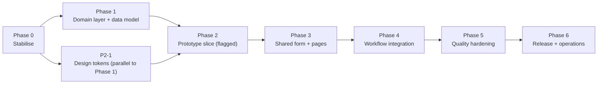

# HospitiumRIS — Researcher Proposals: Implementation Plan

**Scope:** `/researcher/projects/proposals/{list,create,view/[id],edit/[id]}` and the `api/proposals/**` routes behind them
**Prepared for:** Stephen Gaita, HospitiumRIS
**Date:** 19 September 2026
**Companion document:** `proposals-analysis-report.md` — finding IDs (X-, L-, C-, V-, E-, A-) refer to its register
**Related:** *Review Process Analysis & Target-State Design* (RP) — this plan is sequenced so its Phase 0–1 land **before** RP Phase 1, because RP assumes verified identities and a single status writer.

---

## 1. Approach

### 1.1 Understanding → workflow → prototype → production

Following your working preference, the plan goes in this order: (1) the **application and workflow are pinned down** (report §2–3); (2) the **highest-risk defects are removed first** without redesign (Phase 0); (3) a **server-side domain layer** is built and tested (Phase 1); (4) a **thin vertical prototype** of the new experience is put in front of you behind a feature flag (Phase 2) *before* the full build; (5) the shared form and pages are completed (Phase 3); (6) review-engine integration, quality hardening and release follow (Phases 4–6).

### 1.2 Stack decisions (defaults from your preferences)

| Concern | Decision |
|---|---|
| Frontend | Next.js (App Router), **JavaScript**, **MUI** (no Tailwind) |
| Backend | Next.js route handlers now; **domain logic in framework-agnostic modules** (`src/lib/proposals/`) so it ports to Python/FastAPI when `docs/PYTHON_BACKEND_MIGRATION.md` proceeds. Contract kept in **OpenAPI** so Pydantic models can be generated later. |
| Database | Postgres via Prisma; additive migrations only until cut-over; every migration has a backfill script and a rollback note |
| New libraries | `react-hook-form` + `zod` (form + shared validation), `@tanstack/react-query` (server state), `date-fns` (durations/formatting), optionally `@mui/x-data-grid` (community). Dev: `vitest` (unit), `@playwright/test` + `@axe-core/playwright` (E2E + a11y), `eslint` + `eslint-config-next`. |
| Feature flag | `institution.enabledModules` already exists; add `proposalsV2` flag (per institution, default off) so new pages ship dark and roll out gradually |
| Branching | Trunk-based with short-lived branches; each work item = one PR with its tests; Phase 0 items are independent and can merge in any order |

### 1.3 How this plan maps to the Review Process roadmap

Do these **once**, not twice:

| This plan | RP roadmap | Note |
|---|---|---|
| P0-1 (`await params`) | — | New: RP did not know the routes were dead on Next 16 |
| P0-2 (auth) | RP P0-2 | Same work item |
| P0-3 (status single-writer, remove self-approve) | RP P0-1, P0-8 | Same work item; this plan adds the researcher-list part |
| P4-4 (notifications) | RP P0-4 | The working `notificationService` is delivered by the RP roadmap; this plan only fixes the proposal payloads and consumes it |
| P1-1 (ownership/tenancy columns) | RP P1-1 | Same migration — coordinate so it is run once |
| P1-4 (`ProposalEvent`) | RP P1-3 (`ReviewEvent`) | Use one table |
| Phase 4 | RP P1-2, P2-1…P2-6 | Engine cut-over is the RP's job; this plan supplies the researcher-facing side (via an adapter until the engine lands) |

---

## 2. Phase overview

| Phase | Goal | Effort (dev-weeks) | Calendar with 2 devs | Exit criteria |
|---|---|---|---|---|
| **0 — Stabilise** | Remove data-loss, self-approval, dead-route and no-auth defects with minimal change | ≈ 7.6 | ≈ 4 wks | All Critical findings closed; no silent-loss path left; anonymous access returns 401; regression tests exist for each fix |
| **1 — Domain layer & data model** | Ownership, tenancy, validation, policy, audit, attachments, thin API | ≈ 10.4 | ≈ 5–6 wks | New service + API pass unit/integration tests; legacy routes are wrappers; migration + backfill rehearsed on a copy of the DB |
| **2 — Prototype (vertical slice)** | Prove the new UX end-to-end on a narrow slice behind a flag | ≈ 5.6 | ≈ 3 wks (overlaps Phase 1) | Demo: create → autosave → review & submit → tracker on the new list; user feedback captured; decisions recorded |
| **3 — Shared form & pages** | Complete list v2, `ProposalForm`, view v2, edit modes, budget/team | ≈ 13.6 | ≈ 7 wks | Old pages removed; parity + new features; axe clean on all four pages |
| **4 — Workflow integration** | Submit starts the review engine; revision loop; researcher tracker; award recording | ≈ 6.2 | ≈ 3–4 wks | A proposal goes draft → approved through the engine with researcher-visible feedback |
| **5 — Quality hardening** | a11y audit, i18n, dark mode, performance, E2E, security review | ≈ 7.2 | ≈ 4 wks | Targets in report §6.9 met and measured |
| **6 — Release & operations** | Rollout, monitoring, runbooks, docs, contract migration | ≈ 2.6 | ≈ 1.5 wks + 2-wk staged rollout | Production checklist (§13) complete |
| **Total** | | **≈ 53 dev-weeks** (range ≈ 40–70 at ±30 %) | **≈ 6–7 months** with two developers | |

These figures are the **sum of the work-item estimates in §3–§9** (S = 2 d, S–M = 3 d, M = 4 d, M–L = 6 d, L = 8 d, XL = 15 d), not a top-down guess; the script-checked total is in Appendix F.2. They assume one experienced full-stack developer per "dev-week", no waiting on other teams, and that the RP engine work is done by the RP roadmap (Phase 4 uses an adapter until then).

**Where to stop if time is short**

| Slice | Contents | Effort | What you get |
|---|---|---|---|
| **A — Make it safe** | Phase 0 | ≈ 7.6 dev-weeks | No self-approval, no silent overwrites, no anonymous access, working on Next 16. **Do this regardless.** |
| **B — Make it correct** | Phases 0–1 | ≈ 18 dev-weeks | Server-owned rules, ownership/tenancy, validation, audit, safe files; the old UI still works on top |
| **C — Make it professional** | Phases 0–3 | ≈ 37 dev-weeks | New list/form/view, design system, dark mode, accessibility baseline |
| **D — Production-ready** | Phases 0–6 | ≈ 53 dev-weeks | Workflow integrated, measured quality, staged rollout |

Effort scale: **S** ≤ 2 days · **M** 3–5 days · **L** 1–2 weeks · **XL** 2–4 weeks (one experienced full-stack developer; order-of-magnitude estimates from reading the code, ±30 %).



---

## 3. Phase 0 — Stabilise (≈ 7.6 dev-weeks)

**Rule for this phase:** smallest change that removes the defect; no redesign. **Every item starts with a failing test** (or a scripted reproduction against a scratch database) so the "C"-tagged findings from the report are confirmed before they are fixed.

| ID | Work item | Resolves | Effort |
|---|---|---|---|
| P0-0 | **Scratch DB + reproduction harness.** Seed a throwaway Postgres (Docker) with three proposals; write Vitest/`node:test` scripts that call the route handlers directly and assert today's broken behaviour (edit → DRAFT, PI overwritten, resume drops dates, PUT drops publication links, PUT replaces file arrays, anonymous read, self-approve). These become the regression suite. | confirms all C-tagged | M |
| P0-1 | **`await params`** in the 7 broken proposal handlers (files, link-ethics ×2, link-ethics/[ethicsId], review-stage, review-status, submit), then repo-wide for the other 17 handlers. | X-3, L-4 (partly) | S |
| P0-2 | **Authentication and authorisation.** Add `requireUser(request)` (401) and `requireProposalAccess(user, id, action)` (403/404) helpers; apply to every `api/proposals/**` handler. Researchers: own proposals (owner match by user id where present, else ORCID — **fail closed** when neither exists). Institution roles: proposals of their institution (until P1-1 adds `institutionId`, allow only `INSTITUTION_ADMIN`/`RESEARCH_ADMIN` explicitly). Add a client-side guard in a new `researcher/layout.js` (redirect to `/login`) and a root `proxy.js` that rejects unauthenticated `/api/proposals/**`. | X-1, A-1, A-6, X-4 (interim) | M |
| P0-3 | **Single status writer (interim).** `POST/PUT/PATCH` ignore any `status` from the client. Add `POST /api/proposals/[id]/submit` (owner only, `DRAFT`/`REVISION_REQUESTED` → `SUBMITTED`; starts the pipeline **if** a default pipeline exists, otherwise still submits and records an event — do not 400 the researcher). `PATCH` and `…/status` become institution-role only, and `PATCH` stops overwriting `totalBudgetAmount` (write `awardedAmount` to a new nullable column — small migration) and stops fabricating a review. **Remove "Approve & Award Grant" and the no-op "Delete Proposal" from the researcher list.** Create page's Submit calls `/submit`. | X-2, L-1, A-3, C-2 (interim), L-6 (part) | M |
| P0-4 | **Edit safety.** Edit page stops sending `status`; PUT never touches `status`; PI fields are preserved unless the user explicitly picked a different PI (`piOption` restored from data: `useProfile` only when the stored ORCID equals the user's); PUT syncs `proposalPublication` / `proposalManuscript` (diff + transaction); edit page loads existing links. | E-1, E-2, E-3 | M |
| P0-5 | **Resume-draft and PI-picker fixes on create.** Restore `startDate/endDate`; format grant dates as `yyyy-MM-dd`; fix `principalInvestigatorName` vs `principalInvestigator` mismatch; initialise `lastSavedData` from loaded data; dirty flag ignores defaults; disable autosave until first user edit; serialise autosaves (one in flight, latest wins) and set `proposalId` before any second POST. | C-4, C-5, C-6, C-7 (part) | M |
| P0-6 | **Submit gate v0 + confirm.** Wire the existing `isStepValid` rules into the wizard (Next disabled with inline errors; Submit runs all steps and lists what is missing) and add a confirm dialog; server-side `submit` re-checks the same required fields (title, PI, ≥1 department, ≥1 research area, abstract, objectives, methodology, funding source, budget > 0). Full ruleset comes in P1-2. | C-1 | S–M |
| P0-7 | **Delete and ownership rules.** `DELETE` only by owner, only `DRAFT`, soft-delete column (`deletedAt`) or, if the migration is deferred, hard delete plus removal of files; never for other statuses. | A-2 | S |
| P0-8 | **File safety (interim).** Sanitise names (reuse the milestone route's pattern), random storage names (`crypto.randomUUID()`), 25 MB / 10-file limits, allow-list of extensions **and** MIME, stop returning `filePath`, PUT **appends** rather than replaces, autosave uploads each file once (mark uploaded files), add authorised `DELETE …/files/[fileName]`. | A-4, E-4, C-7 (part), C-11 (part) | M |
| P0-9 | **Content and control fixes.** Remove `Add "…"` and the fabricated department fallback; replace hard-coded name/ORCID with the signed-in user; correct breadcrumbs on the view page and wire an Edit/Revise button by status; compute duration with `differenceInCalendarMonths`; drop "Days in Review" for non-review statuses; status filter lists all statuses; **wire or remove Sort By and Timeframe** (wire: client sort/filter until P3-3 makes it server-side); show API errors (not the empty state); page `<title>`s. | V-1, C-3, V-3, V-4, L-2, L-8, L-7 (part) | S–M |
| P0-10 | **Prisma singleton** in proposals routes; remove `$disconnect()`; remove PII `console.log`. | X-5, A-8 | S |
| P0-11 | **CI baseline.** Add ESLint config + `eslint`; add `test` script and run the P0-0 suite in CI; fail the build on lint errors in changed files. | X-7 (part) | S |

**Exit criteria (Phase 0)**

- [ ] Editing an Approved/Under-review proposal leaves status and PI unchanged (test).
- [ ] A researcher cannot change status or award anything (test); the menu items are gone.
- [ ] Anonymous `GET /api/proposals` and `/api/proposals/[id]` → 401; another researcher's proposal → 404.
- [ ] `review-status`, files, submit, link-ethics respond correctly on Next 16.
- [ ] Resume draft → dates and PI intact; "different PI" saves.
- [ ] No path returns a server filesystem path; uploads honour limits.
- [ ] CI runs lint + the regression suite.

**Sketches (for reference, not final code)**

```js
// P0-1: every dynamic route handler
export async function GET(request, { params }) {
  const { id } = await params;          // Next 16: params is a Promise
  ...
}
```

```js
// P0-2: src/lib/proposals/access.js
import { getAuthenticatedUser } from '../auth-server.js';

export class HttpError extends Error {
  constructor(status, message) { super(message); this.status = status; }
}

export async function requireUser(request) {
  const user = await getAuthenticatedUser(request);
  if (!user) throw new HttpError(401, 'Authentication required');
  return user;
}

export async function requireProposalAccess(user, proposal, action) {
  if (!proposal || proposal.deletedAt) throw new HttpError(404, 'Not found');   // 404 hides existence
  if (!can(user, action, proposal)) throw new HttpError(404, 'Not found');
  return proposal;
}

export const withApi = (handler) => async (request, ctx) => {
  try { return await handler(request, ctx); }
  catch (e) {
    if (e instanceof HttpError) return Response.json({ error: e.message }, { status: e.status });
    console.error('proposals api error', { path: new URL(request.url).pathname, message: e.message });
    return Response.json({ error: 'Unexpected error' }, { status: 500 });
  }
};
```

```js
// P0-8: file name + type safety
const ALLOWED = { '.pdf': 'application/pdf', '.doc': 'application/msword',
  '.docx': 'application/vnd.openxmlformats-officedocument.wordprocessingml.document',
  '.xlsx': '…', '.pptx': '…', '.txt': 'text/plain', '.png': 'image/png', '.jpg': 'image/jpeg' };
const MAX_BYTES = 25 * 1024 * 1024;

export function safeStoredName(original) {
  const ext = path.extname(original).toLowerCase();
  if (!ALLOWED[ext]) throw new HttpError(400, `File type ${ext} not allowed`);
  return `${crypto.randomUUID()}${ext}`;                 // never reuse the client's name in the path
}
export const displayName = (n) => n.replace(/[^\w.\-() ]+/g, '_').slice(0, 200);
```

---

## 4. Phase 1 — Domain layer & data model (≈ 10.4 dev-weeks)

**Goal:** move every rule (identity, tenancy, validation, status, files, audit) out of pages and route files into one tested server-side module, and give the data model the columns and tables the target state needs. Legacy routes keep working as thin wrappers so nothing breaks while pages are rebuilt.

**Principles:** *expand → migrate → contract* (additive migrations first, dual-read from old JSON columns until the backfill is verified, drop only in Phase 6); no framework imports inside `src/lib/proposals/` except Prisma, so it ports to FastAPI/Pydantic; each function takes `(actor, input)` and returns data or throws `HttpError`.

| ID | Work item | Resolves | Effort |
|---|---|---|---|
| P1-1 | **Migration A — ownership, tenancy, lifecycle columns.** `Proposal`: `ownerId` (FK `User`), `institutionId` (FK), `referenceNumber` (unique per institution, format `PRP-YYYY-NNN` from a per-institution counter row), `version` (int, default 1), `submittedAt`, `decidedAt`, `deletedAt`, `budgetCurrency` (default `USD`), `awardedAmount` (nullable, from P0-3). Status enum adds `WITHDRAWN` and `CONDITIONAL_APPROVAL` (per RP Appendix B — **one shared migration with the RP roadmap**). Indexes: `(institutionId, status, deletedAt)`, `(ownerId, deletedAt, updatedAt)`, `(referenceNumber)`. Backfill script: `ownerId` by ORCID → `User`, else flagged for manual review; `institutionId` from owner; reference numbers by `createdAt`; `submittedAt` from the earliest non-draft event/`updatedAt` (marked *estimated*). | X-4, L-12 (ref no.) | M |
| P1-2 | **Validation schemas** (`src/lib/proposals/schema.js`, zod). `draftSchema` (title only required; everything else typed and bounded), `submitSchema` (full ruleset — report Appendix A), `checkSubmit(proposal) → [{ field, step, code, severity, message }]`. Same module imported by client forms and server. Bounds: title ≤ 300, abstract 50–2,000 chars (institution-configurable), arrays ≤ 50, dates ISO, `end > start`, budget ≥ 0 and finite, enums closed. | X-6, C-1 (server side), C-9 (fields) | M |
| P1-3 | **Policy** (`policy.js`): `can(user, action, proposal)` for `view · edit · submit · withdraw · delete · duplicate · attach · download · comment · record-award · set-status`, implementing report §6.3 plus institution roles. Table-driven unit tests: every status × role × action. Returns a reason code so the UI can explain *why* something is disabled. | A-1, A-6, E-6 (rules) | S–M |
| P1-4 | **Migration B — new tables.** `ProposalMember` (role, effort %, ORCID/email, `isPi`, `coi`), `ProposalBudgetLine` (category, year, amount, note), `ProposalAttachment` (kind, displayName, storageKey, mime, bytes, sha256, uploadedBy, uploadedAt, `deletedAt`), `ProposalEvent` (append-only; `type`, `actorId`, `fromStatus`, `toStatus`, `payload` JSON, `at`, `requestId`; same shape as RP `ReviewEvent` — **one table**), `ProposalVersion` (snapshot JSON, `versionNo`, `reason`, `createdBy`). Backfill: JSON file arrays → `ProposalAttachment` (checksum computed where the file exists; missing files flagged, not dropped); co-investigator JSON → `ProposalMember`; `otherRelatedFiles` status-log entries → `ProposalEvent`. Old columns stay readable (dual-read) until P6-5. | A-7, E-4 (data), V-5 (data) | M–L |
| P1-5 | **Service** (`service.js`): `createDraft`, `updateDraft` (partial merge, **`If-Match: version`** → 409 with the server copy on conflict), `submit` (one transaction: policy → `checkSubmit` → snapshot `ProposalVersion` → `status`, `submittedAt` → `ProposalEvent` → outbox row for notifications → start pipeline via RP engine adapter when present; **idempotent** — a second call returns the same result), `withdraw(reason)`, `duplicate`, `softDelete`, `restore`, `recordAward` (institution roles). One mapper for row ⇄ DTO so POST and PUT can no longer disagree. | A-2, A-5, E-5, C-2 (server), X-2 | L |
| P1-6 | **Attachments module** (`attachments.js`) behind a `Storage` interface (`put/get/delete/signedUrl`); local-disk driver now, S3-compatible driver later. Enforces size/count/extension/MIME allow-list, random keys, SHA-256, per-proposal quota; download route checks `can(…,'download')`; virus-scan hook (no-op by default, configurable). Responses never contain paths. | A-4, C-11 (server) | M |
| P1-7 | **API v1** (`/api/proposals/**`, see Appendix A): list (slim projection, `page/pageSize≤100/sort/status/q`, per-status counts, `needsMyAction`), get (includes team, budget lines, attachments, `events`, `allowedActions`), create, patch, submit, withdraw, duplicate, delete, attachments CRUD, events. Uniform error body `{ error: { code, message, fields? } }`. Legacy `POST/PUT` become wrappers that call the service and are marked `Deprecation` in the response header. | L-3, L-4 (server), V-2 (data) | L |
| P1-8 | **Audit + logging.** `recordEvent(tx, …)` used by every service function; `requestId` middleware; structured JSON logger with PII scrubbing (no ORCID/email/body in logs); fixes `userId: null` in activity log. | A-7, A-8 | S |
| P1-9 | **OpenAPI 3.1 spec** (`docs/openapi/proposals.yaml`) generated from the zod schemas + route table; contract test that every route's real response validates against it. Becomes the input for the Pydantic models later. | X-6, portability | S–M |
| P1-10 | **Tests.** Unit (schema, policy, mappers, storage), integration (service + route handlers against Postgres in CI via service container; each test in a rolled-back transaction or fresh schema), coverage gate ≥ 85 % on `src/lib/proposals/`. The Phase 0 regression suite is moved to run through the service. | X-7 | M |
| P1-11 | **Backfill rehearsal.** Restore a copy of the real DB into staging, run migrations A and B and the backfills, run **verification queries** (row counts equal; no proposal without owner unless flagged; every JSON file entry has an attachment or a "missing" flag; no status changed) and write the report. Document rollback (restore snapshot; the new columns are additive so the old code keeps working). | risk | M |
| P1-12 | **Flag plumbing.** `proposalsV2` in `institution.enabledModules`; `isEnabled(user, 'proposalsV2')` on the server and `useFeature()` on the client; admin toggle on the institution settings page. | rollout | S |

**Exit criteria (Phase 1)**

- [ ] All items above merged; coverage gate green; OpenAPI contract test green.
- [ ] Migrations A and B and both backfills rehearsed on a copy of production data with a signed-off verification report.
- [ ] `PATCH` with a stale `version` → 409; two tabs cannot silently overwrite each other (integration test).
- [ ] `submit` twice → one event, one version snapshot (idempotency test).
- [ ] Legacy pages still work against the wrapper routes (Phase 0 E2E smoke still green).

---

## 5. Phase 2 — Prototype (vertical slice, behind the flag) (≈ 5.6 dev-weeks)

**Why a prototype:** the target design changes the look, the form and the mental model. Before building all seven steps and all tabs, a narrow slice is put in front of real researchers to confirm the direction and settle the open decisions in report §7.

**Slice:** *create a proposal with Basics + Science → auto-save → Review & submit → see it on the new list with status/stage → open the new view page.* Steps 3–6 render as "coming soon" placeholders that still round-trip with the API.

| ID | Work item | Resolves | Effort |
|---|---|---|---|
| P2-1 | **Design tokens.** Extend the theme: text-safe primary (`#6f52a3`, 6.16:1) and a separate brand fill, `status` palette map (draft/submitted/under review/revision/approved/rejected/withdrawn — icon + label + colour, each ≥ 4.5:1 in light **and** dark), caption colour ≥ 4.5:1, focus ring, spacing scale. `ProposalStatusChip` is the only place status colour is defined. Add an ESLint rule (or CI grep) forbidding hex literals under `researcher/projects/proposals/**`. | X-9, X-11, L-11, V-8 (colour) | M |
| P2-2 | **Flagged routes.** The four route files check `proposalsV2` on the server and render the v2 components or the legacy page (`?legacy=1` stays available to admins for one release). New shared `researcher/layout.js` (from P0-2) provides the auth guard, breadcrumbs slot and per-page `<title>` via `generateMetadata`. | rollout, E-8 | S |
| P2-3 | **List v2 (slice).** Server-side search/filter/pagination via API v1, clickable status filter chips with counts, title as link/row click, stage/next-step column (from the projection), loading skeletons, error state with Retry, empty state. No Approve/Award. | L-2, L-3, L-4, L-7, L-8, L-10 (slice) | M |
| P2-4 | **`ProposalForm` (slice).** react-hook-form + zod; steps *Basics*, *Science*, *Review & submit*; `useAutosave` (2 s debounce, serialised, `version`-aware, status pill "Saving… / Saved 14:32 / Couldn't save – retry"); error summary and focus management; confirm dialog on submit; blocked-submit checklist with "Fix" links. | C-1, C-4, C-5, C-6, C-7, C-10 (slice) | L |
| P2-5 | **View v2 (slice).** Header (title `h1`, reference, status chip, PI, dates, correct duration), *Overview* and *Activity* tabs (timeline from `ProposalEvent`), status-dependent action bar (Edit / Revise / Withdraw), breadcrumbs `Proposals › PRP-…`. | V-1, V-2, V-3, V-4 (slice) | M |
| P2-6 | **Prototype QA.** Playwright smoke for the slice + axe on the three pages; then **five moderated sessions** with researchers (scripted tasks: create, resume, find a proposal, understand a status, respond to a revision request) and one research-office user; findings logged as tickets. | validation | M |
| P2-7 | **Decision checkpoint.** Close report §7 items 1–8 (or accept the recommended defaults) and record them in `docs/decisions/proposals-v2.md`; re-baseline Phase 3 estimates if scope moved. | governance | S |

**Exit criteria (Phase 2)**

- [ ] Demo recorded: sign in → create → auto-save survives reload → submit blocked with checklist → fix → confirm → submit → appears on new list as *Submitted* with a stage.
- [ ] axe: zero critical/serious on the three slice pages in light and dark.
- [ ] Usability findings triaged; report §7 decisions recorded; go/no-go for Phase 3.

---

## 6. Phase 3 — Shared form & pages (≈ 13.6 dev-weeks)

**Goal:** complete the four pages on the v2 stack, reach feature parity **plus** the target-state capabilities, and delete the legacy pages. Two developers can work in parallel: one on the form/edit modes (P3-2, P3-5, P3-6, P3-7, P3-8), one on list/view/shared components (P3-1, P3-3, P3-4).

| ID | Work item | Resolves | Effort |
|---|---|---|---|
| P3-1 | **Shared components:** `SectionCard`, `TeamTable`, `BudgetTable`, `AttachmentUploader`, `ConfirmDialog`, `useSnackbar` (with *Undo*), `EmptyState`, `ErrorState`, accessible `Stepper` (nav list, `aria-current="step"`, ✔/! state). Replace every `alert()`/`window.confirm()`. Storybook-lite: one `/dev/proposals-kit` page (dev only) to review them in light/dark. | L-6, X-10, X-12 | L |
| P3-2 | **`ProposalForm` complete:** all seven steps from report §6.5, one component for create/resume/edit; shared schema; per-step validation state; unsaved-changes and offline handling (keep local edits, retry with back-off); conflict dialog "Updated by X — reload / compare"; PI rules (owner unless deliberately changed; never implicit). Old 4,730-/2,471-line pages deleted. | C-9, C-10, C-13, E-5, E-7, X-12 | XL |
| P3-3 | **List v2 complete:** server-side sort + timeframe, saved views (per-user, localStorage → server later), funder and year filters, **Needs my action**, reference/funder/budget/updated columns, column chooser (MUI X Data Grid community *or* MUI Table — decision §7-7), CSV export (respects filters and policy), stacked cards on `xs`, keyboard-operable row actions with visible names. | L-10, L-12, L-2, L-3 | L |
| P3-4 | **View v2 complete:** tabs *Overview · Science · Work plan · Budget · Team · Ethics & data · Documents · Activity & reviews · Versions* with roles and `?tab=` deep links; renders everything captured (team, milestones/deliverables timeline, budget table, linked publications/manuscripts, grant info); documents via authorised download with a *Download* label and real upload dates; rich text keeps lists/line breaks; `h1`/`h2` structure; locale-aware currency/dates; PDF export (server-rendered, same data as the page). | V-5, V-6, V-7, V-2, E-8 | L |
| P3-5 | **Edit modes.** `draft` (normal), `revision` (reviewer comments beside sections, changed-fields tracking, required "summary of changes" on resubmit), `amendment` (approved → request amendment → new round), `locked` (banner explaining why, with the next possible action). The mode comes from `allowedActions` returned by the API, never computed in the page. | E-6, E-1, E-2 (UX) | L |
| P3-6 | **Team & budget builder v1.** Team table (role, effort %, ORCID lookup, COI flag; PI is the owner unless changed), budget lines by category × year, computed total checked against the entered total, currency selector, justification field. No institutional rate tables (decision §7-4). | C-9 | L |
| P3-7 | **Ethics & data step.** Link only ethics applications the user owns or is a member of (authorised endpoint, not the global list); record external approval (body, number, date); human-participants question drives requirements; data-management-plan fields. | C-12 | M |
| P3-8 | **Attachments UX.** Typed slots with per-type rules shown up front, progress bar, per-file error, replace/remove (soft-delete server-side), each file uploaded exactly once, screen-reader announcements. | C-11, E-4 | M |
| P3-9 | **Clean-up.** Delete `page_backup.js`, `page.js.backup`, `simulateStatusUpdate`, dead validators, and legacy pages; add a CI check for hex literals and `alert(`/`confirm(` under the proposals directory. | X-13, C-13 | S |
| P3-10 | **Copy and help text.** Plain-language field help, empty-state copy, and error messages reviewed by the research office; all strings through `t()` keys (translations in P5-2). | usability, X-8 (keys) | S–M |

**Exit criteria (Phase 3)**

- [ ] Legacy create/edit/list/view pages removed; the four routes serve v2 for flagged institutions.
- [ ] Six acceptance journeys (Appendix E) pass in Playwright.
- [ ] axe: zero critical/serious on all four pages, light and dark, at 360/768/1280 px.
- [ ] No hex literals, `alert(`, `confirm(` in the proposals pages; Lighthouse accessibility ≥ 95.

---

## 7. Phase 4 — Workflow integration (≈ 6.2 dev-weeks)

**Dependency:** the Review Process (RP) engine. If RP Phases 1–2 have not landed, this phase uses the **adapter** in `src/lib/proposals/engine.js` (`startReview`, `getStage`, `listFeedback`) with an interim implementation over today's pipeline tables; the adapter's interface does not change when the RP engine replaces it.

| ID | Work item | Resolves | Effort |
|---|---|---|---|
| P4-1 | **Submit starts the review.** `submit` (P1-5) calls `engine.startReview(proposalId)` inside the same transaction/outbox; failure to find a default pipeline puts the proposal in *Submitted — awaiting assignment* with an event and an alert to the research office (never a 400 for the researcher). | C-2 | M |
| P4-2 | **Researcher tracker.** Replace "Review Pipeline / No pipeline assigned" with current stage, days in stage vs SLA, and next expected step, from `engine.getStage`; *Needs my action* badge for revision requests and conditions; same component on list and view. | L-9 | M |
| P4-3 | **Revision loop.** Reviewer comments and decisions visible to the author (author-visible flag on each comment), shown in *Activity & reviews* and beside sections in revision mode; point-by-point response per comment; **Resubmit** creates a `ProposalVersion`, a `ProposalEvent`, and reopens the round. | L-5, V-2 | L |
| P4-4 | **Notifications.** Consume RP P0-4 (working `notificationService`); fix payload shape (`userId`/`type`/`title`/`message`), notify owner + team on submit/decision/revision-request, notify reviewers/admins on submit and resubmit; e-mail templates; in-app bell links to the proposal tab. Outbox pattern so a failed send never rolls back a submit. | C-8 | M |
| P4-5 | **Award recording (institution side).** *Record award* dialog on the institution proposal view: awarded amount, currency, award date, sponsor reference, conditions; writes `awardedAmount`, `decidedAt`, event; researcher sees *Requested* vs *Awarded*; link *Open in grant tracker* creates or opens the linked grant record. Researcher list has **no** approve action. | L-1, A-3 (end state) | M |
| P4-6 | **Withdraw / reopen / amendment.** Withdraw with reason from Draft…Revision; reopen Withdrawn → Draft; *Request amendment* on Approved opens a new review round. Transitions come from the engine's table, not the page. | E-6 | M |
| P4-7 | **Activity timeline component** shared by view (author-visible events) and institution pages (all events), reading `ProposalEvent`; filters by type; accessible list semantics. | V-2, A-7 | S–M |

**Exit criteria (Phase 4)**

- [ ] Journey: submit → engine assigns stage → reviewer requests revision → researcher sees comments → responds and resubmits → approval → award recorded → researcher sees *Awarded $X* — all through the UI, no direct DB edits.
- [ ] Notification failure test: mail provider down → submit still succeeds, retry occurs, event visible.
- [ ] No code path outside the engine/service writes `Proposal.status` (grep-based CI check + integration test).

---

## 8. Phase 5 — Quality hardening (≈ 7.2 dev-weeks)

| ID | Work item | Resolves | Effort |
|---|---|---|---|
| P5-1 | **Accessibility audit.** axe in CI on all four pages × light/dark; manual keyboard-only pass (stepper, dialogs, menus, table, tabs); NVDA + VoiceOver walkthrough of the create and revise journeys; fix findings; publish a short VPAT-style conformance note. | X-10, V-8 | M |
| P5-2 | **Internationalisation.** Extract all strings to namespaced keys (`proposals.*`); complete `en`; translate `fr`, `es`, `ar` (RTL check) as the pilot set and queue the other 16 through the existing locale workflow; `Intl.DateTimeFormat` / `NumberFormat` with active locale and proposal currency; pseudo-locale test to catch truncation. | X-8 | M–L |
| P5-3 | **Dark mode & visual regression.** Playwright screenshot baselines for the four pages × light/dark × 3 widths; fix contrast/overflow issues. | X-9 | S–M |
| P5-4 | **Performance.** Seed 10,000 proposals; verify list p95 < 400 ms with the indexes from P1-1; measure autosave latency; bundle analysis (route-level code-splitting for wizard steps and PDF export); Lighthouse budget in CI; remove N+1 queries in `GET` include trees. | L-3 | M |
| P5-5 | **E2E suite.** Playwright projects (chromium, firefox, webkit-smoke) for the six journeys (Appendix E), running against a seeded scratch DB; traces and videos on failure; run on every PR (smoke) and nightly (full). | X-7 | L |
| P5-6 | **Security review.** Authorisation matrix test (every route × role × status), upload abuse cases (path traversal, double extension, oversized, MIME mismatch, zip bombs where relevant), IDOR sweep, rate limiting on autosave/upload, `npm audit`/dependency review, security headers, CSRF check for cookie-authenticated mutations. Confirm with the Security & Data-Privacy gap analysis items that touch proposals. | A-1, A-4, A-6 | M |
| P5-7 | **Observability.** Request id propagation, structured logs, error-tracking hook (Sentry-compatible), metrics (submit success rate, autosave conflict rate, upload failures, p95 latencies), dashboards and alerts. | A-8 | M |
| P5-8 | **Load and soak.** k6 (or autocannon) scripts: 200 concurrent researchers listing/searching, 50 concurrent autosaves, 20 concurrent uploads; watch DB connections (Prisma singleton) and memory. | X-5 | S–M |

**Exit criteria (Phase 5):** every target in report §6.9 is *measured* and recorded in `docs/quality/proposals-v2-baseline.md`; nightly E2E green for 7 consecutive days.

---

## 9. Phase 6 — Release & operations (≈ 2.6 dev-weeks)

| ID | Work item | Resolves | Effort |
|---|---|---|---|
| P6-1 | **Staged rollout.** Enable `proposalsV2` for one pilot institution (internal), then 10 %, 50 %, 100 % of institutions over ≈ 2 weeks; go/no-go criteria per step (error rate, autosave conflict rate, support tickets, p95 latency). | rollout | S |
| P6-2 | **Production migration.** Snapshot → run migrations A/B + backfills in a maintenance window (expected minutes; rehearsed in P1-11) → verification queries → sign-off; the manual-review list (proposals without an owner match) resolved with the research office. | data integrity | S–M |
| P6-3 | **Runbooks and rollback drill.** Runbooks: failed migration, stuck submit/outbox, storage full, mass-revert flag; rehearse flag rollback and DB restore in staging. | ops | S–M |
| P6-4 | **User and admin documentation.** Researcher guide (create, autosave, submit, revise, withdraw), research-office guide (award recording, assignments), FAQ, release notes, in-app "What's new". | adoption | S |
| P6-5 | **Contract phase.** After one stable release: remove `?legacy=1`, legacy route wrappers, JSON file-array columns and `otherRelatedFiles` status log (final migration C), and the dual-read code. | X-13 | S–M |

**Exit criteria (Phase 6):** production checklist (§13) complete; flag at 100 % for two weeks with no Sev-1/2; contract migration merged.

---

## 10. Test strategy

| Layer | What it proves | Tooling | Runs | Gate |
|---|---|---|---|---|
| Unit | Schemas, policy matrix, mappers, storage driver, duration/currency helpers | Vitest | every PR | ≥ 85 % lines on `src/lib/proposals/`; 100 % of policy cells (status × role × action) |
| Integration | Service + route handlers against real Postgres: happy paths, 401/403/404, 409 conflicts, idempotent submit, transaction rollback on failure, file limits | Vitest + Prisma test schema (Docker/service container) | every PR | all green |
| Contract | Real responses validate against `docs/openapi/proposals.yaml`; the spec is what a FastAPI port must satisfy | `ajv` / `openapi-response-validator` | every PR | all green |
| Component | `ProposalStatusChip`, `TeamTable`, `BudgetTable`, `AttachmentUploader`, `ConfirmDialog`, stepper keyboard behaviour | Vitest + Testing Library | every PR | key components covered |
| E2E | Six journeys (Appendix E) end-to-end on a seeded DB | Playwright (chromium on PR; + firefox/webkit nightly) | PR smoke, nightly full | smoke green to merge; nightly green 7 days before Phase 6 |
| Accessibility | No critical/serious axe violations; keyboard traversal; focus after dialog/step change | `@axe-core/playwright` + manual NVDA/VoiceOver pass | every PR (axe), release (manual) | 0 critical/serious |
| Visual | Layout/contrast regressions in light/dark and 3 widths | Playwright screenshots | nightly | reviewed diffs |
| Performance | List p95, autosave latency, bundle size | k6/autocannon, Lighthouse CI | nightly + before rollout | targets in report §6.9 |
| Security | Authorisation matrix, IDOR sweep, upload abuse, dependency audit | Vitest matrix, `npm audit`, manual review | every PR (matrix), release | no High/Critical open |

**Test data and environments**

- **Local / CI:** disposable Postgres, `scripts/seed-proposals.js` creating users for each role, one institution, and a proposal in every status; a `--bulk 10000` option for performance tests.
- **Staging:** nightly restore of a **scrubbed** copy of production (names/e-mails/ORCIDs replaced) used for migration rehearsal and load tests.
- **Rule:** every bug fixed from the report first gets a failing test (Phase 0 harness), so regressions are impossible to reintroduce silently.

---

## 11. Migration, rollout and rollback

### 11.1 Expand → migrate → contract

| Step | Change | Reversible by |
|---|---|---|
| Expand (P0-3, P1-1, P1-4) | Add nullable columns and new tables; no reads switched yet | Old code ignores them; restore snapshot if a migration itself fails |
| Backfill (P1-1, P1-4, P1-11) | Scripts are idempotent, batch-wise, log every skipped/ambiguous row, produce a verification report | Re-run; the source columns are untouched |
| Dual-read (Phase 1–5) | Service reads new tables, falls back to legacy JSON when a proposal has no rows yet | Feature flag off → legacy pages read legacy columns |
| Switch (Phase 6) | Flag on for institutions in stages | Flag off per institution, minutes |
| Contract (P6-5) | Drop legacy JSON columns, legacy wrappers, `?legacy=1` | Only after one stable release and a fresh snapshot |

### 11.2 Rollout ladder (P6-1)

1. Internal/test institution (all Phase 0–5 features, real users = staff).
2. Pilot institution (friendly research office) — one week, daily check-in.
3. 10 % → 50 % → 100 % of institutions, ≥ 3 days per step.
   **Advance only if:** submit success ≥ 99 %, autosave error rate < 1 %, no data-loss report, p95 within target, no open Sev-1/2.

### 11.3 Rollback

| Failure | Action | Time |
|---|---|---|
| UI regression / confusing UX | Flag off for the institution (falls back to the last legacy pages — which already include Phase 0 fixes) | minutes |
| Bad backfill | Restore the pre-migration snapshot; nothing was dropped | ≈ 1 h |
| Storage driver problem | Switch driver back to local disk via env var; files keep their keys | minutes |
| Engine/notification failure | Outbox retries; if persistent, submit still succeeds and the research office is alerted; disable auto-start via a config flag | minutes |

---

## 12. Risk register

| # | Risk | Likelihood | Impact | Mitigation | Owner |
|---|---|---|---|---|---|
| R1 | Estimates are ±30 %; Phase 3 (XL form) is the largest uncertainty | Med | Med | Prototype (Phase 2) de-risks the form; slice A/B/C/D lets you stop at a coherent point; re-baseline at P2-7 | Tech lead |
| R2 | RP engine slips, blocking Phase 4 | Med | Med | `engine.js` adapter over today's tables; Phase 4 acceptance uses the adapter first | Tech lead |
| R3 | Backfill mis-assigns owners (ORCID not unique or missing) | Med | High | Fail closed: unmatched proposals get no owner and appear on a research-office review list; rehearsal on scrubbed prod copy; verification queries | Data owner |
| R4 | Phase 0 auth breaks existing users who relied on open APIs (e.g. other modules calling `/api/proposals`) | Med | Med | Grep for internal consumers first (`review`, dashboard, grant tracker); add tests for each; announce in release notes | Dev |
| R5 | Two teams change `Proposal` at once (RP + this plan) | High | Med | One shared migration owner; single branch for schema changes; weekly sync | Tech lead |
| R6 | New libraries (rhf/zod/TanStack Query) add learning curve | Low | Low | Small, standard, well documented; pair on P2-4; keep patterns in `docs/decisions` | Dev |
| R7 | Users dislike the redesigned form | Med | Med | Five moderated sessions in Phase 2; pilot institution; flag rollback | Product |
| R8 | Uploads scanned/served unsafely after storage change | Low | High | Storage interface + tests; allow-list; download only via authorised route; virus-scan hook enabled in production | Security |
| R9 | Auto-save + optimistic concurrency produce confusing conflicts | Med | Med | Conflict dialog with compare; single in-flight save; telemetry on conflict rate (alert > 2 %) | Dev |
| R10 | i18n scope explodes (19 locales) | Med | Low | Pilot 3 locales; others through the existing locale workflow after release; keys complete from day one | Product |
| R11 | Live evidence was read-only; some write-path defects are code-verified only | Low | Med | P0-0 reproduces each on a scratch DB before fixing | Dev |

---

## 13. Production-readiness checklist and Definition of Done

**Definition of Done (every work item)**

- [ ] Acceptance criteria met; failing-test-first where the item fixes a defect.
- [ ] Unit/integration tests added; coverage gate green; lint clean.
- [ ] No new hex literals, `alert(`/`confirm(`, `console.log` of PII, or `new PrismaClient()`.
- [ ] Strings through `t()`; keyboard and screen-reader behaviour checked for any UI.
- [ ] Docs/OpenAPI updated; migration has backfill + rollback note.
- [ ] Reviewed by a second developer; demo or screenshot in the PR.

**Production-readiness checklist (release gate for Phase 6)**

| Area | Check | ☐ |
|---|---|---|
| Security | Every `api/proposals/**` route authenticated + authorised; matrix test green; no client-set status; no server paths in responses; uploads allow-listed and served via authorised route | ☐ |
| Data | Backfill verified on production copy; snapshot taken; no proposal without owner unless flagged and resolved | ☐ |
| Correctness | Editing never changes status/PI; submit gated by server-side ruleset; submit idempotent; single status writer enforced by CI check | ☐ |
| Reliability | Optimistic concurrency; auto-save retry/back-off; outbox for notifications; error states never look like empty states | ☐ |
| UX | Four pages on v2; status language and colours consistent; confirm + undo on destructive actions; empty/loading/error states | ☐ |
| Accessibility | axe 0 critical/serious (light/dark, 3 widths); manual keyboard + screen-reader pass recorded | ☐ |
| i18n | `en` complete; pilot locales translated; RTL checked; dates/currency via `Intl` | ☐ |
| Performance | List p95 < 400 ms at 10k rows; autosave < 300 ms; no N+1 requests; Lighthouse budget met | ☐ |
| Observability | Request-id logs, error tracking, dashboards, alerts (submit failures, conflict rate, upload errors) | ☐ |
| Operations | Runbooks written and drilled; flag rollback rehearsed; on-call informed; support docs and release notes published | ☐ |
| Quality | Six E2E journeys nightly-green for 7 days; unit/integration coverage gates green | ☐ |
| Governance | Decisions log (`docs/decisions/proposals-v2.md`) complete; RP roadmap coordination confirmed | ☐ |

---

## 14. Assumptions and decisions needed

The eight decisions in report §7 apply unchanged (recommended defaults are used in the estimates). Additional decisions specific to delivery:

| # | Decision | Recommended default | Needed by |
|---|---|---|---|
| D1 | Staffing: two full-stack developers + part-time designer/UX researcher + QA support | Two devs; designer for Phase 2 sessions and Phase 3 review | Before Phase 0 |
| D2 | Do Phase 0 now, independent of the redesign | **Yes** — it removes live risk and is a prerequisite for everything | Now |
| D3 | Who owns the shared `Proposal`/`ProposalEvent` migration with the RP roadmap | One named owner; single migration branch | Before Phase 1 |
| D4 | Pilot institution and research-office contact for Phase 2 sessions and Phase 6 pilot | Named by the product owner | Before Phase 2 |
| D5 | Attachments: virus scanning provider/configuration in production | Enable ClamAV-compatible hook; block on positive | Phase 5 |
| D6 | Translations: who reviews `fr`/`es`/`ar` | Institution-side reviewers | Phase 5 |
| D7 | Python backend timing: port `src/lib/proposals` when the FastAPI migration starts, using `docs/openapi/proposals.yaml` as the contract | Yes; do not wait for it | Ongoing |

**Assumptions:** the live app and repo state described in the report remain current (re-run P0-0 first to confirm); the Next.js 16 / React 19 / MUI 7 / Prisma 6 versions stay; production data volumes are in the low thousands of proposals per institution.

---

## 15. Automation and improvement opportunities

- **CI is the biggest lever.** A Playwright + axe job over the four pages (P0-11 → P5-5) turns this whole audit into a repeatable check that runs on every PR, so the defects in the report cannot quietly return.
- **Codemod for Next 16 `params`.** The 24 affected handlers repo-wide are mechanical; a small jscodeshift script (or a targeted ESLint rule) fixes and then guards against the pattern.
- **Reusable "page audit" Skill.** This engagement followed a repeatable recipe (live pages → code read → axe scan → findings register → target state → phased plan). It is a good candidate for a Claude Skill you can run against other modules (Ethics, Grants, Publications). After a few more runs, update your Skills and preferences with what worked (e.g. effort scale, report layout, benchmark sources).
- **Guardrail scripts.** Simple CI greps — `new PrismaClient(`, hex literals under `researcher/`, `alert(`, `status:` writes outside the service — are cheap and catch the exact problems found here.

---

## Appendix A — API v1 contract (summary)

All routes: authenticated (`401`), policy-checked (`404` for anything the caller may not see), JSON in/out, `requestId` echoed in `X-Request-Id`. Errors: `{ "error": { "code", "message", "fields"?: [{ "path", "code", "message" }] } }`.

| Method & path | Purpose | Who | Notes |
|---|---|---|---|
| `GET /api/proposals` | List | Owner/team (own), institution roles (institution) | `page`, `pageSize` (≤ 100), `sort`, `status`, `q`, `funder`, `year`, `needsMyAction`; returns `{ items[], page, pageSize, total, counts{byStatus, needsMyAction} }`; items are a slim projection (id, ref, title, status, stage, funder, budget, updatedAt) |
| `POST /api/proposals` | Create draft | Authenticated researcher | Only `title` required; server sets owner, institution, ref, status `DRAFT`; ignores any `status`/`owner` in the body |
| `GET /api/proposals/:id` | Detail | View policy | Includes team, budget lines, attachments (metadata only), recent events, `version`, `allowedActions[]` |
| `PATCH /api/proposals/:id` | Partial update (auto-save) | Edit policy | `If-Match: <version>` → `409 version_conflict` with the server copy; never accepts `status` |
| `POST /api/proposals/:id/validate` | Dry-run `checkSubmit` | Edit policy | Returns `[{ field, step, code, severity, message }]` for step 7 |
| `POST /api/proposals/:id/submit` | Submit / resubmit | Owner (or team Editor if configured) | `422 submit_blocked` with the same checks list; idempotent; body may include `responseSummary` in revision mode |
| `POST /api/proposals/:id/withdraw` | Withdraw | Owner | `{ reason }` required |
| `POST /api/proposals/:id/duplicate` | Copy as new draft | Owner | Excludes events/reviews/awards |
| `DELETE /api/proposals/:id` | Soft delete | Owner; `DRAFT`/`WITHDRAWN` only | `204`; `POST …/restore` within 30 days |
| `POST /api/proposals/:id/attachments` | Upload one file | Edit policy | multipart; `kind`, size/type limits (`413`, `415`); returns attachment metadata |
| `GET /api/proposals/:id/attachments/:aid` | Download | View policy | Streams with safe `Content-Disposition`; no server paths |
| `DELETE /api/proposals/:id/attachments/:aid` | Remove | Edit policy | soft delete + event |
| `GET /api/proposals/:id/events` | Activity | View policy | Authors see author-visible events only |
| `POST /api/proposals/:id/award` | Record award | Research office / admin | `{ amount, currency, awardedAt, sponsorRef, conditions? }`; never touches requested budget |
| `PUT /api/proposals/:id`, `PATCH …/status`, `POST …/review-stage` | **Legacy** | wrappers only | Marked `Deprecation`; removed in P6-5. `status` writes limited to institution roles and routed through the engine |

| HTTP | Code | Meaning |
|---|---|---|
| 400 | `validation_failed` | Schema error (fields listed) |
| 401 | `unauthenticated` | No/invalid session |
| 404 | `not_found` | Missing **or** not visible to the caller |
| 409 | `version_conflict` | Stale `If-Match`; body carries the current version |
| 413 / 415 | `file_too_large` / `file_type_not_allowed` | Upload rules |
| 422 | `submit_blocked` | Blocking checks failed |
| 429 | `rate_limited` | Auto-save/upload throttling |

## Appendix B — Prisma sketch (additive; illustrative)

```prisma
model Proposal {
  // existing columns unchanged …
  ownerId          String?
  owner            User?        @relation("ProposalOwner", fields: [ownerId], references: [id])
  institutionId    String?
  referenceNumber  String?
  version          Int          @default(1)
  submittedAt      DateTime?
  decidedAt        DateTime?
  deletedAt        DateTime?
  budgetCurrency   String       @default("USD")
  awardedAmount    Decimal?     @db.Decimal(14, 2)

  members          ProposalMember[]
  budgetLines      ProposalBudgetLine[]
  attachments      ProposalAttachment[]
  events           ProposalEvent[]
  versions         ProposalVersion[]

  @@unique([institutionId, referenceNumber])
  @@index([institutionId, status, deletedAt])
  @@index([ownerId, deletedAt, updatedAt])
}

model ProposalMember {
  id          String  @id @default(cuid())
  proposalId  String
  proposal    Proposal @relation(fields: [proposalId], references: [id], onDelete: Cascade)
  userId      String?
  name        String
  email       String?
  orcid       String?
  role        String            // PI | CO_I | COLLABORATOR | …
  isPi        Boolean @default(false)
  canEdit     Boolean @default(false)
  effortPct   Int?
  hasCoi      Boolean @default(false)
  @@index([proposalId])
}

model ProposalAttachment {
  id          String   @id @default(cuid())
  proposalId  String
  proposal    Proposal @relation(fields: [proposalId], references: [id], onDelete: Cascade)
  kind        String            // PROPOSAL_DOC | ETHICS | BUDGET | DMP | OTHER
  displayName String
  storageKey  String   @unique   // random; never the client's file name
  mime        String
  bytes       Int
  sha256      String
  uploadedBy  String
  uploadedAt  DateTime @default(now())
  deletedAt   DateTime?
  @@index([proposalId, deletedAt])
}

model ProposalEvent {              // same shape as RP ReviewEvent — one table
  id          String   @id @default(cuid())
  proposalId  String
  proposal    Proposal @relation(fields: [proposalId], references: [id], onDelete: Cascade)
  type        String            // CREATED | UPDATED | SUBMITTED | STAGE_STARTED | COMMENT | DECISION | WITHDRAWN | AWARD_RECORDED | …
  actorId     String?
  fromStatus  String?
  toStatus    String?
  authorVisible Boolean @default(false)
  payload     Json?
  requestId   String?
  at          DateTime @default(now())
  @@index([proposalId, at])
}
```

## Appendix C — Policy sketch

```js
// src/lib/proposals/policy.js  (framework-agnostic; ported 1:1 to Python later)
const EDITABLE = new Set(['DRAFT', 'REVISION_REQUESTED']);
const ADMIN_ROLES = new Set(['INSTITUTION_ADMIN', 'RESEARCH_ADMIN']);

export function can(user, action, p) {
  if (!user || !p || p.deletedAt) return false;
  const sameInstitution = p.institutionId && p.institutionId === user.institutionId;
  const isOwner = p.ownerId === user.id;
  const isEditor = isOwner || p.members?.some(m => m.userId === user.id && m.canEdit);
  const isMember = isEditor || p.members?.some(m => m.userId === user.id);
  const isAdmin = sameInstitution && ADMIN_ROLES.has(user.role);

  switch (action) {
    case 'view':        return isMember || isAdmin;
    case 'edit':        return isEditor && EDITABLE.has(p.status);
    case 'submit':      return isOwner && EDITABLE.has(p.status);
    case 'withdraw':    return isOwner && ['DRAFT','SUBMITTED','UNDER_REVIEW','REVISION_REQUESTED'].includes(p.status);
    case 'delete':      return isOwner && ['DRAFT','WITHDRAWN'].includes(p.status);
    case 'duplicate':   return isMember;
    case 'attach':      return isEditor && EDITABLE.has(p.status);
    case 'download':    return isMember || isAdmin;
    case 'record-award':
    case 'set-status':  return isAdmin;             // and only via the engine
    default:            return false;
  }
}

// allowedActions returned by GET /:id, so the UI never re-implements the rules
export const allowedActions = (user, p) =>
  ['view','edit','submit','withdraw','delete','duplicate','attach','download'].filter(a => can(user, a, p));
```

## Appendix D — File-by-file change map

| Path (under `src/`) | Change | Phase |
|---|---|---|
| `app/researcher/layout.js` (new) | Auth guard, breadcrumbs slot | 0 / 2 |
| `proxy.js` (new) | Reject unauthenticated `/api/proposals/**` | 0 |
| `lib/prisma.js` | Used by all proposal routes (singleton) | 0 |
| `lib/proposals/{access,schema,policy,service,attachments,mappers,engine,storage}.js` (new) | Domain layer | 0–4 |
| `app/api/proposals/route.js` | POST/GET → thin wrappers over service (list projection, counts) | 0–1 |
| `app/api/proposals/[id]/route.js` | GET/PATCH/DELETE → service; PUT legacy wrapper; remove `status` handling and budget overwrite | 0–1 |
| `app/api/proposals/[id]/{submit,review-stage,review-status,link-ethics,files/[fileName]}` | `await params`; auth; submit → service; files → attachments API | 0–1 |
| `app/api/proposals/[id]/{validate,withdraw,duplicate,attachments,events,award}` (new) | API v1 | 1 / 4 |
| `app/researcher/projects/proposals/list/page.js` | P0 fixes → replaced by List v2 (`components/Proposals/list/*`) | 0 → 2–3 |
| `app/researcher/projects/proposals/create/page.js` (4,730 lines) | P0 fixes → replaced by `ProposalForm` (`components/Proposals/form/*`) | 0 → 2–3 |
| `app/researcher/projects/proposals/edit/[id]/page.js` (2,471) | P0 fixes → `ProposalForm mode=edit` | 0 → 3 |
| `app/researcher/projects/proposals/view/[id]/page.js` (+ `page_backup.js`) | P0 fixes → View v2 (`components/Proposals/view/*`); delete backup | 0 → 3 |
| `components/Proposals/{ProposalStatusChip,SectionCard,TeamTable,BudgetTable,AttachmentUploader,ConfirmDialog,ActivityTimeline,ProposalStatusTracker}.js` (new) | Shared UI | 2–4 |
| `components/Proposals/ProposalReviewStatus.js` | Replaced by tracker | 4 |
| `theme/*` | Tokens, status palette, dark-mode values | 2 |
| `locales/*/proposals.json` | New namespace | 3 / 5 |
| `prisma/schema.prisma` + `prisma/migrations/*` | Migrations A, B, C | 1 / 6 |
| `scripts/{seed-proposals,backfill-proposals,verify-proposals}.js` (new) | Data tooling | 0–1 |
| `docs/openapi/proposals.yaml`, `docs/decisions/proposals-v2.md`, `docs/quality/proposals-v2-baseline.md`, runbooks (new) | Documentation | 1–6 |
| `.github/workflows/ci.yml`, `eslint.config.mjs`, `vitest.config.js`, `playwright.config.js` (new) | CI | 0 / 5 |

## Appendix E — Acceptance journeys (Playwright)

| # | Journey | Must prove |
|---|---|---|
| J1 | **Create and submit.** New proposal → fill steps → autosave indicator → attempt submit with gaps → checklist with Fix links → fix → confirm → submitted | Server-side gate; confirm dialog; status `SUBMITTED`; appears on list with stage; event recorded; second click on Submit does nothing |
| J2 | **Resume and edit a draft.** Reload mid-form; dates, PI, files intact; change PI via ORCID search → saved; edit from list | No silent loss (C-4, C-5, C-7); PI only changes deliberately (E-2) |
| J3 | **Find and track.** Search, filter by status chip, sort, open a proposal by row click, see stage/next step, open Activity | Server-side controls; counts; no per-row requests; correct duration and dates |
| J4 | **Revision loop.** Reviewer requests changes → researcher sees comments → revision mode → respond → resubmit | Feedback visible (L-5); status only changes via engine; version snapshot created |
| J5 | **Locked, withdraw, delete.** Under-review proposal cannot be edited (banner explains); withdraw with reason; draft delete + undo | Policy honoured in UI and API; soft delete |
| J6 | **Authorisation.** Anonymous → 401; other researcher → 404; researcher cannot approve/award/set status; institution admin can record award; uploads reject bad types/sizes | A-1, A-2, A-4, A-6, L-1 |

Every journey also runs axe (light and dark) and is repeated at 360 px.

---

## Appendix F — Traceability and effort check

### F.1 Every finding maps to at least one work item

The register in the companion report has **62 findings** (7 Critical, 27 High, 23 Medium, 5 Low). Each appears in the *Resolves* column of at least one work item (checked by script when this plan was finalised).

| Finding | Severity | Summary | Work items |
|---|---|---|---|
| X-1 | High | No route guard for `/researcher/ | P0-2 |
| X-2 | Critical | Status is client-controlled | P0-3, P1-5 |
| X-3 | High | Next.js 16 breaks synchronous `params` | P0-1 |
| X-4 | High | `Proposal` has no owner or institution | P0-2, P1-1 |
| X-5 | High | A new `PrismaClient` per route file, disconnected after every request | P0-10, P5-8 |
| X-6 | High | No server-side validation layer | P1-2, P1-9 |
| X-7 | Medium | No automated tests and no lint configuration | P0-11, P1-10, P5-5 |
| X-8 | Medium | Internationalisation is not applied | P3-10, P5-2 |
| X-9 | High | Dark mode is broken on these pages | P2-1, P5-3 |
| X-10 | Medium | Accessibility defects on every page | P3-1, P5-1 |
| X-11 | Medium | Inconsistent status language and colour | P2-1 |
| X-12 | Medium | Copy-paste divergence | P3-1, P3-2 |
| X-13 | Low | Repo hygiene | P3-9, P6-5 |
| L-1 | Critical | A researcher can "Approve & Award Grant" on their own proposal | P0-3, P4-5 |
| L-2 | High | Sort By and Timeframe filters are cosmetic | P0-9, P2-3, P3-3 |
| L-3 | High | List data handling does not scale and misreports | P1-7, P2-3, P3-3, P5-4 |
| L-4 | High | N+1 tracking requests, all failing | P0-1, P1-7, P2-3 |
| L-5 | High | Rejection / revision feedback never reaches the researcher | P4-3 |
| L-6 | Medium | Dead and blocking controls | P0-3, P3-1 |
| L-7 | Medium | Search refetches on every keystroke | P0-9, P2-3 |
| L-8 | Medium | Filters and stats ignore half the lifecycle | P0-9, P2-3 |
| L-9 | Medium | "Review Pipeline" column shows no useful information | P4-2 |
| L-10 | Medium | Table usability | P2-3, P3-3 |
| L-11 | Low | Weak visual hierarchy | P2-1 |
| L-12 | Medium | Missing list capabilities | P1-1, P3-3 |
| C-1 | Critical | Submit performs no validation and asks for no confirmation | P0-6, P1-2, P2-4 |
| C-2 | Critical | Submit bypasses the configured review workflow | P0-3, P1-5, P4-1 |
| C-3 | High | A developer's identity is hard-coded as "your profile" | P0-9 |
| C-4 | High | "Search for a different Principal Investigator" cannot be saved | P0-5, P2-4 |
| C-5 | High | Resuming a draft loses data | P0-5, P2-4 |
| C-6 | Medium | A blank form says "Unsaved changes" | P0-5, P2-4 |
| C-7 | High | Auto-save is unreliable and duplicates files | P0-5, P0-8, P2-4 |
| C-8 | High | Submission notifications are rejected by the server | P4-4 |
| C-9 | Medium | Form content falls short of a proposal record | P1-2, P3-2, P3-6 |
| C-10 | Medium | Wizard UX gaps | P2-4, P3-2 |
| C-11 | Medium | Weak client-side upload rules | P0-8, P1-6, P3-8 |
| C-12 | Medium | Ethics linking uses a global, unauthenticated list | P3-7 |
| C-13 | Low | Maintainability: | P3-2, P3-9 |
| V-1 | High | Placeholder text is shown to users | P0-9, P2-5 |
| V-2 | High | Review History is always empty | P1-7, P2-5, P3-4, P4-3, P4-7 |
| V-3 | High | Wrong context and no actions | P0-9, P2-5 |
| V-4 | Medium | Derived numbers are wrong or meaningless | P0-9, P2-5 |
| V-5 | High | The page omits most of what was captured | P1-4, P3-4 |
| V-6 | Medium | Documents tab is fragile | P3-4 |
| V-7 | Medium | Semantics | P3-4 |
| V-8 | Medium | Contrast | P2-1, P5-1 |
| E-1 | Critical | Every save resets the proposal to DRAFT | P0-4, P3-5 |
| E-2 | Critical | The editor becomes the PI | P0-4, P3-5 |
| E-3 | High | Edits to linked publications and manuscripts are discarded | P0-4 |
| E-4 | High | File edits do not work | P0-8, P1-4, P3-8 |
| E-5 | High | No concurrency control or history | P1-5, P3-2 |
| E-6 | High | No rules or context for editing by status | P1-3, P3-5, P4-6 |
| E-7 | Medium | Validation and safety nets are missing | P3-2 |
| E-8 | Low | Redundant headings | P2-2, P3-4 |
| A-1 | Critical | `GET /[id]`, `PUT`, `PATCH`, `DELETE` and `POST` perform no authentication… | P0-2, P1-3, P5-6 |
| A-2 | High | `DELETE` is a hard delete for any status, by anyone | P0-7, P1-5 |
| A-3 | High | Approve overwrites the requested budget | P0-3, P4-5 |
| A-4 | High | File handling is unsafe and non-portable | P0-8, P1-6, P5-6 |
| A-5 | Medium | POST and PUT disagree | P1-5 |
| A-6 | High | Researcher scoping fails open | P0-2, P1-3, P5-6 |
| A-7 | Medium | Audit data is stored in the file list | P1-4, P1-8, P4-7 |
| A-8 | Low | Noisy and leaky logging | P0-10, P1-8, P5-7 |

### F.2 Effort totals (sum of the work-item estimates)

Scale: S = 2 d, S–M = 3 d, M = 4 d, M–L = 6 d, L = 8 d, XL = 15 d.

| Phase | Work items | Person-days | Dev-weeks |
|---|---|---|---|
| 0 | 12 | 38 | 7.6 |
| 1 | 12 | 52 | 10.4 |
| 2 | 7 | 28 | 5.6 |
| 3 | 10 | 68 | 13.6 |
| 4 | 7 | 31 | 6.2 |
| 5 | 8 | 36 | 7.2 |
| 6 | 5 | 13 | 2.6 |
| **Total** | **61** | **266** | **53.2** |

